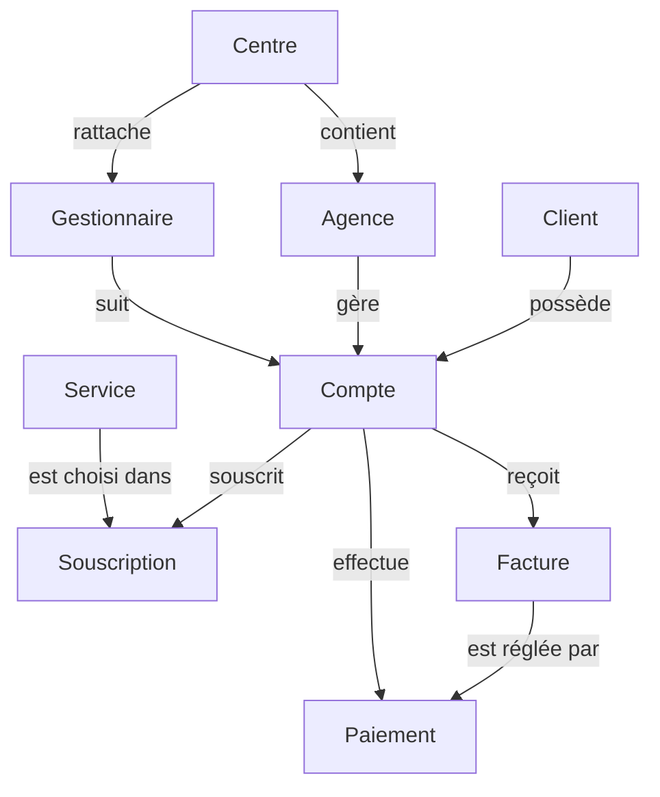
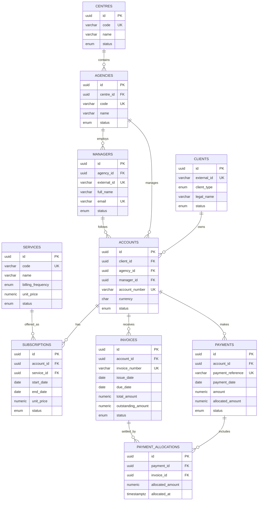
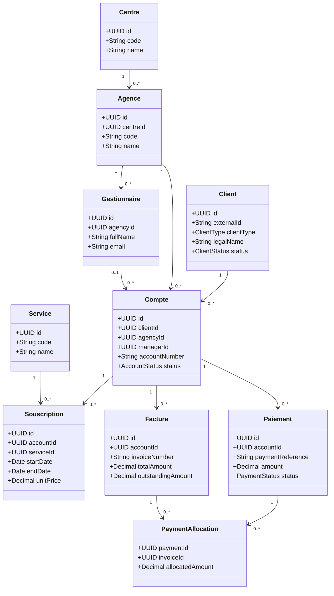
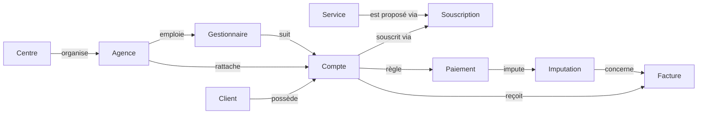
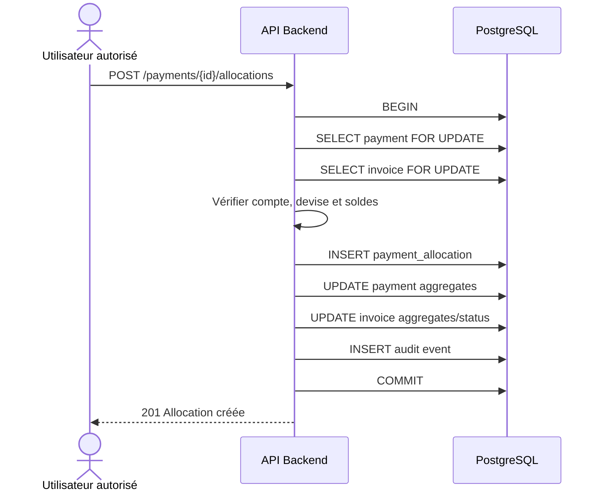

# Backend Schema officiel

## GBLRecover — Modèle de données, persistance et contrats backend

| Élément | Valeur |
|---|---|
| **Produit** | GBLRecover |
| **Organisation** | CAMTEL |
| **Domaine** | Revenue Assurance, comptes, abonnements, facturation et paiements |
| **Document** | Backend Schema — Database & Backend Contract |
| **Version** | 1.0 |
| **Statut** | Spécification officielle d’implémentation |
| **Base cible** | PostgreSQL 16 |
| **ORM cible** | SQLAlchemy 2.0 côté backend ; Prisma fourni comme représentation de schéma |
| **Auteur** | Database Architecture |
| **Date** | 7 août 2026 |

> **Objectif.** Ce document définit le modèle de données de GBLRecover avec un niveau de précision permettant à une équipe backend de créer directement la base PostgreSQL, ses migrations, ses modèles ORM, ses validations et ses endpoints REST.

> **Périmètre métier.** Le modèle couvre les entités Client, Compte, Gestionnaire, Agence, Centre, Service, Souscription, Facture et Paiement. Les créances sont représentées par le solde restant dû des factures et par des vues ou agrégats de recouvrement ; une table dédiée `receivables` pourra être ajoutée lorsque les règles de dette et de recouvrement seront validées.

---

## 1. Architecture des données

### 1.1 Principes

Le modèle est relationnel et normalisé jusqu’à la troisième forme normale. Les identifiants techniques sont des UUID ; les identifiants métier externes sont conservés séparément afin de permettre les imports et les rapprochements avec les systèmes CAMTEL.

Les données financières ne sont jamais supprimées physiquement dans le fonctionnement courant. Les statuts `CANCELLED`, `INACTIVE` ou `ARCHIVED` sont utilisés pour préserver l’historique et l’auditabilité. Les montants utilisent `NUMERIC`, jamais `FLOAT`.

### 1.2 Architecture logique



---

## 2. Description des entités

### 2.1 Client

Le client est la personne physique ou morale titulaire d’un ou plusieurs comptes CAMTEL. Il constitue le point d’entrée principal de la vue client et de la recherche métier.

| Attribut | Type | Obligatoire | Règle |
|---|---|---:|---|
| `id` | UUID | Oui | Clé primaire générée par la base |
| `external_id` | VARCHAR(100) | Oui | Identifiant provenant du système source ; unique |
| `client_type` | ENUM | Oui | `INDIVIDUAL` ou `ORGANIZATION` |
| `legal_name` | VARCHAR(255) | Oui | Nom légal ou nom complet |
| `tax_identifier` | VARCHAR(100) | Non | Identifiant fiscal, unique lorsqu’il est renseigné |
| `phone` | VARCHAR(30) | Non | Numéro normalisé |
| `email` | VARCHAR(255) | Non | Email validé si renseigné |
| `address` | TEXT | Non | Adresse postale |
| `status` | ENUM | Oui | `ACTIVE`, `INACTIVE`, `BLOCKED`, `ARCHIVED` |
| `source_system` | VARCHAR(80) | Oui | Système d’origine |
| `source_updated_at` | TIMESTAMPTZ | Non | Date de dernière mise à jour source |
| `created_at` | TIMESTAMPTZ | Oui | Défaut `now()` |
| `updated_at` | TIMESTAMPTZ | Oui | Mis à jour à chaque modification |

### 2.2 Compte

Le compte est l’unité financière ou contractuelle rattachée à un client. Un client peut posséder plusieurs comptes ; un compte appartient à un seul client.

| Attribut | Type | Obligatoire | Règle |
|---|---|---:|---|
| `id` | UUID | Oui | Clé primaire |
| `client_id` | UUID | Oui | FK vers `clients.id` |
| `agency_id` | UUID | Oui | FK vers `agencies.id` |
| `manager_id` | UUID | Non | FK vers `managers.id` |
| `external_id` | VARCHAR(100) | Oui | Identifiant source unique |
| `account_number` | VARCHAR(80) | Oui | Numéro métier unique |
| `currency` | CHAR(3) | Oui | Code devise ISO validé, défaut selon CAMTEL |
| `status` | ENUM | Oui | `ACTIVE`, `SUSPENDED`, `CLOSED`, `ARCHIVED` |
| `opened_at` | DATE | Non | Date d’ouverture |
| `closed_at` | DATE | Non | Doit être renseignée si statut `CLOSED` |
| `created_at` | TIMESTAMPTZ | Oui | Audit technique |
| `updated_at` | TIMESTAMPTZ | Oui | Audit technique |

### 2.3 Gestionnaire

Le gestionnaire est l’utilisateur métier responsable d’un portefeuille de comptes ou d’actions de recouvrement. Il est rattaché à une agence et, indirectement, à un centre.

| Attribut | Type | Obligatoire | Règle |
|---|---|---:|---|
| `id` | UUID | Oui | Clé primaire |
| `agency_id` | UUID | Oui | FK vers `agencies.id` |
| `external_id` | VARCHAR(100) | Oui | Identifiant RH ou source |
| `employee_number` | VARCHAR(50) | Non | Matricule unique si renseigné |
| `full_name` | VARCHAR(255) | Oui | Nom d’affichage |
| `email` | VARCHAR(255) | Oui | Email professionnel unique |
| `status` | ENUM | Oui | `ACTIVE`, `INACTIVE`, `SUSPENDED` |
| `created_at` | TIMESTAMPTZ | Oui | Audit technique |
| `updated_at` | TIMESTAMPTZ | Oui | Audit technique |

### 2.4 Centre

Le centre est le niveau organisationnel supérieur utilisé pour le pilotage et le filtrage des données.

| Attribut | Type | Obligatoire | Règle |
|---|---|---:|---|
| `id` | UUID | Oui | Clé primaire |
| `code` | VARCHAR(30) | Oui | Code unique et stable |
| `name` | VARCHAR(150) | Oui | Nom du centre |
| `status` | ENUM | Oui | `ACTIVE`, `INACTIVE` |
| `created_at` | TIMESTAMPTZ | Oui | Audit technique |
| `updated_at` | TIMESTAMPTZ | Oui | Audit technique |

### 2.5 Agence

L’agence est une unité opérationnelle rattachée à un centre. Elle porte le rattachement principal des comptes et gestionnaires.

| Attribut | Type | Obligatoire | Règle |
|---|---|---:|---|
| `id` | UUID | Oui | Clé primaire |
| `centre_id` | UUID | Oui | FK vers `centres.id` |
| `code` | VARCHAR(30) | Oui | Unique dans le périmètre CAMTEL |
| `name` | VARCHAR(150) | Oui | Nom de l’agence |
| `address` | TEXT | Non | Adresse |
| `status` | ENUM | Oui | `ACTIVE`, `INACTIVE` |
| `created_at` | TIMESTAMPTZ | Oui | Audit technique |
| `updated_at` | TIMESTAMPTZ | Oui | Audit technique |

### 2.6 Service

Le service représente une offre ou prestation CAMTEL pouvant être souscrite par un compte.

| Attribut | Type | Obligatoire | Règle |
|---|---|---:|---|
| `id` | UUID | Oui | Clé primaire |
| `code` | VARCHAR(50) | Oui | Code service unique |
| `name` | VARCHAR(150) | Oui | Libellé |
| `description` | TEXT | Non | Description fonctionnelle |
| `billing_frequency` | ENUM | Oui | `MONTHLY`, `QUARTERLY`, `ANNUAL`, `ONE_TIME` |
| `unit_price` | NUMERIC(14,2) | Non | Prix catalogue si applicable |
| `currency` | CHAR(3) | Non | Devise du prix catalogue |
| `status` | ENUM | Oui | `ACTIVE`, `INACTIVE` |
| `created_at` | TIMESTAMPTZ | Oui | Audit technique |
| `updated_at` | TIMESTAMPTZ | Oui | Audit technique |

### 2.7 Souscription

La souscription est l’association historisée entre un compte et un service. Elle porte les dates de début et de fin, le tarif appliqué et l’état du service pour ce compte.

| Attribut | Type | Obligatoire | Règle |
|---|---|---:|---|
| `id` | UUID | Oui | Clé primaire |
| `account_id` | UUID | Oui | FK vers `accounts.id` |
| `service_id` | UUID | Oui | FK vers `services.id` |
| `external_id` | VARCHAR(100) | Non | Référence source |
| `start_date` | DATE | Oui | Date de début |
| `end_date` | DATE | Non | Supérieure ou égale à `start_date` |
| `unit_price` | NUMERIC(14,2) | Oui | Prix appliqué au moment de la souscription |
| `currency` | CHAR(3) | Oui | Devise du tarif |
| `status` | ENUM | Oui | `PENDING`, `ACTIVE`, `SUSPENDED`, `TERMINATED` |
| `created_at` | TIMESTAMPTZ | Oui | Audit technique |
| `updated_at` | TIMESTAMPTZ | Oui | Audit technique |

### 2.8 Facture

La facture est le document financier émis pour un compte. Elle représente la dette avant paiement et conserve les montants d’origine, de taxe, de règlement et de solde.

| Attribut | Type | Obligatoire | Règle |
|---|---|---:|---|
| `id` | UUID | Oui | Clé primaire |
| `account_id` | UUID | Oui | FK vers `accounts.id` |
| `external_id` | VARCHAR(100) | Oui | Identifiant source unique |
| `invoice_number` | VARCHAR(80) | Oui | Numéro métier unique |
| `issue_date` | DATE | Oui | Date d’émission |
| `due_date` | DATE | Oui | Date d’exigibilité, ≥ issue date |
| `subtotal_amount` | NUMERIC(14,2) | Oui | Montant hors taxes |
| `tax_amount` | NUMERIC(14,2) | Oui | Montant taxe |
| `total_amount` | NUMERIC(14,2) | Oui | `subtotal + tax` selon règle validée |
| `paid_amount` | NUMERIC(14,2) | Oui | Total des paiements imputés |
| `outstanding_amount` | NUMERIC(14,2) | Oui | `total - paid`, jamais négatif |
| `currency` | CHAR(3) | Oui | Devise de la facture |
| `status` | ENUM | Oui | `DRAFT`, `ISSUED`, `PARTIALLY_PAID`, `PAID`, `OVERDUE`, `CANCELLED` |
| `source_updated_at` | TIMESTAMPTZ | Non | Mise à jour source |
| `created_at` | TIMESTAMPTZ | Oui | Audit technique |
| `updated_at` | TIMESTAMPTZ | Oui | Audit technique |

### 2.9 Paiement

Le paiement est un encaissement effectué pour un compte. Il peut être imputé à une ou plusieurs factures via la table d’association `payment_allocations`.

| Attribut | Type | Obligatoire | Règle |
|---|---|---:|---|
| `id` | UUID | Oui | Clé primaire |
| `account_id` | UUID | Oui | FK vers `accounts.id` |
| `external_id` | VARCHAR(100) | Oui | Identifiant source unique |
| `payment_reference` | VARCHAR(100) | Oui | Référence métier unique |
| `payment_date` | DATE | Oui | Date d’encaissement |
| `amount` | NUMERIC(14,2) | Oui | Strictement positif |
| `allocated_amount` | NUMERIC(14,2) | Oui | Inférieur ou égal à `amount` |
| `unallocated_amount` | NUMERIC(14,2) | Oui | `amount - allocated_amount` |
| `payment_method` | ENUM | Oui | `BANK`, `CASH`, `MOBILE_MONEY`, `CARD`, `TRANSFER`, `OTHER` |
| `currency` | CHAR(3) | Oui | Devise du paiement |
| `status` | ENUM | Oui | `RECEIVED`, `PARTIALLY_ALLOCATED`, `ALLOCATED`, `REVERSED`, `REJECTED` |
| `source_updated_at` | TIMESTAMPTZ | Non | Mise à jour source |
| `created_at` | TIMESTAMPTZ | Oui | Audit technique |
| `updated_at` | TIMESTAMPTZ | Oui | Audit technique |

### 2.10 PaymentAllocation

Cette entité associative permet de représenter une relation plusieurs-à-plusieurs entre paiements et factures. Elle est indispensable pour gérer les paiements partiels, les règlements couvrant plusieurs factures et les imputations différées.

| Attribut | Type | Obligatoire | Règle |
|---|---|---:|---|
| `id` | UUID | Oui | Clé primaire |
| `payment_id` | UUID | Oui | FK vers `payments.id` |
| `invoice_id` | UUID | Oui | FK vers `invoices.id` |
| `allocated_amount` | NUMERIC(14,2) | Oui | Strictement positif |
| `allocated_at` | TIMESTAMPTZ | Oui | Date d’imputation |
| `created_by` | UUID | Non | Acteur si imputation manuelle |
| `created_at` | TIMESTAMPTZ | Oui | Audit technique |

La contrainte unique `(payment_id, invoice_id)` empêche une double ligne d’imputation pour la même paire. Une modification d’imputation doit être auditée et réalisée dans une transaction.

---

## 3. Relations et cardinalités

| Relation | Cardinalité | Règle |
|---|---|---|
| Centre — Agence | 1:N | Un centre possède au moins zéro agence ; une agence appartient à un seul centre |
| Agence — Gestionnaire | 1:N | Un gestionnaire est rattaché à une agence active |
| Client — Compte | 1:N | Un compte appartient à un seul client |
| Agence — Compte | 1:N | Un compte est rattaché à une agence |
| Gestionnaire — Compte | 1:N optionnelle | Un compte peut être affecté à un gestionnaire |
| Compte — Souscription | 1:N | Une souscription appartient à un compte |
| Service — Souscription | 1:N | Un service peut être souscrit plusieurs fois |
| Compte — Facture | 1:N | Une facture appartient à un compte |
| Compte — Paiement | 1:N | Un paiement est rattaché à un compte |
| Paiement — Facture | N:M | Relation via `payment_allocations` |

### 3.1 Diagramme ERD



### 3.2 Diagramme UML de classes



---

## 4. Modèle conceptuel de données (MCD)

Au niveau conceptuel, le client possède des comptes. Les comptes sont gérés par une agence et peuvent être affectés à un gestionnaire. Les comptes souscrivent à des services, reçoivent des factures et effectuent des paiements. Les paiements sont imputés aux factures par une association porteuse de montant.



---

## 5. Modèle logique de données (MLD)

Le MLD relationnel est le suivant :

```text
CENTRES(
  id PK,
  code UK,
  name,
  status,
  created_at,
  updated_at
)

AGENCIES(
  id PK,
  centre_id FK -> CENTRES.id,
  code UK,
  name,
  address,
  status,
  created_at,
  updated_at
)

MANAGERS(
  id PK,
  agency_id FK -> AGENCIES.id,
  external_id UK,
  employee_number UK NULL,
  full_name,
  email UK,
  status,
  created_at,
  updated_at
)

CLIENTS(
  id PK,
  external_id UK,
  client_type,
  legal_name,
  tax_identifier UK NULL,
  phone,
  email,
  address,
  status,
  source_system,
  source_updated_at,
  created_at,
  updated_at
)

ACCOUNTS(
  id PK,
  client_id FK -> CLIENTS.id,
  agency_id FK -> AGENCIES.id,
  manager_id FK -> MANAGERS.id NULL,
  external_id UK,
  account_number UK,
  currency,
  status,
  opened_at,
  closed_at,
  created_at,
  updated_at
)

SERVICES(
  id PK,
  code UK,
  name,
  description,
  billing_frequency,
  unit_price,
  currency,
  status,
  created_at,
  updated_at
)

SUBSCRIPTIONS(
  id PK,
  account_id FK -> ACCOUNTS.id,
  service_id FK -> SERVICES.id,
  external_id NULL,
  start_date,
  end_date NULL,
  unit_price,
  currency,
  status,
  created_at,
  updated_at,
  UK(account_id, service_id, start_date)
)

INVOICES(
  id PK,
  account_id FK -> ACCOUNTS.id,
  external_id UK,
  invoice_number UK,
  issue_date,
  due_date,
  subtotal_amount,
  tax_amount,
  total_amount,
  paid_amount,
  outstanding_amount,
  currency,
  status,
  source_updated_at,
  created_at,
  updated_at
)

PAYMENTS(
  id PK,
  account_id FK -> ACCOUNTS.id,
  external_id UK,
  payment_reference UK,
  payment_date,
  amount,
  allocated_amount,
  unallocated_amount,
  payment_method,
  currency,
  status,
  source_updated_at,
  created_at,
  updated_at
)

PAYMENT_ALLOCATIONS(
  id PK,
  payment_id FK -> PAYMENTS.id,
  invoice_id FK -> INVOICES.id,
  allocated_amount,
  allocated_at,
  created_by NULL,
  created_at,
  UK(payment_id, invoice_id)
)
```

---

## 6. Modèle physique PostgreSQL (MPD)

### 6.1 Extensions et types

```sql
CREATE EXTENSION IF NOT EXISTS pgcrypto;

CREATE TYPE client_type AS ENUM ('INDIVIDUAL', 'ORGANIZATION');
CREATE TYPE centre_status AS ENUM ('ACTIVE', 'INACTIVE');
CREATE TYPE agency_status AS ENUM ('ACTIVE', 'INACTIVE');
CREATE TYPE manager_status AS ENUM ('ACTIVE', 'INACTIVE', 'SUSPENDED');
CREATE TYPE client_status AS ENUM ('ACTIVE', 'INACTIVE', 'BLOCKED', 'ARCHIVED');
CREATE TYPE account_status AS ENUM ('ACTIVE', 'SUSPENDED', 'CLOSED', 'ARCHIVED');
CREATE TYPE service_status AS ENUM ('ACTIVE', 'INACTIVE');
CREATE TYPE billing_frequency AS ENUM ('MONTHLY', 'QUARTERLY', 'ANNUAL', 'ONE_TIME');
CREATE TYPE subscription_status AS ENUM ('PENDING', 'ACTIVE', 'SUSPENDED', 'TERMINATED');
CREATE TYPE invoice_status AS ENUM ('DRAFT', 'ISSUED', 'PARTIALLY_PAID', 'PAID', 'OVERDUE', 'CANCELLED');
CREATE TYPE payment_method AS ENUM ('BANK', 'CASH', 'MOBILE_MONEY', 'CARD', 'TRANSFER', 'OTHER');
CREATE TYPE payment_status AS ENUM ('RECEIVED', 'PARTIALLY_ALLOCATED', 'ALLOCATED', 'REVERSED', 'REJECTED');
```

### 6.2 Schéma SQL complet

```sql
CREATE TABLE centres (
    id UUID PRIMARY KEY DEFAULT gen_random_uuid(),
    code VARCHAR(30) NOT NULL UNIQUE,
    name VARCHAR(150) NOT NULL,
    status centre_status NOT NULL DEFAULT 'ACTIVE',
    created_at TIMESTAMPTZ NOT NULL DEFAULT now(),
    updated_at TIMESTAMPTZ NOT NULL DEFAULT now(),
    CONSTRAINT centres_code_not_blank CHECK (length(trim(code)) > 0),
    CONSTRAINT centres_name_not_blank CHECK (length(trim(name)) > 0)
);

CREATE TABLE agencies (
    id UUID PRIMARY KEY DEFAULT gen_random_uuid(),
    centre_id UUID NOT NULL REFERENCES centres(id) ON UPDATE CASCADE ON DELETE RESTRICT,
    code VARCHAR(30) NOT NULL UNIQUE,
    name VARCHAR(150) NOT NULL,
    address TEXT,
    status agency_status NOT NULL DEFAULT 'ACTIVE',
    created_at TIMESTAMPTZ NOT NULL DEFAULT now(),
    updated_at TIMESTAMPTZ NOT NULL DEFAULT now(),
    CONSTRAINT agencies_code_not_blank CHECK (length(trim(code)) > 0),
    CONSTRAINT agencies_name_not_blank CHECK (length(trim(name)) > 0)
);

CREATE TABLE managers (
    id UUID PRIMARY KEY DEFAULT gen_random_uuid(),
    agency_id UUID NOT NULL REFERENCES agencies(id) ON UPDATE CASCADE ON DELETE RESTRICT,
    external_id VARCHAR(100) NOT NULL UNIQUE,
    employee_number VARCHAR(50) UNIQUE,
    full_name VARCHAR(255) NOT NULL,
    email VARCHAR(255) NOT NULL UNIQUE,
    status manager_status NOT NULL DEFAULT 'ACTIVE',
    created_at TIMESTAMPTZ NOT NULL DEFAULT now(),
    updated_at TIMESTAMPTZ NOT NULL DEFAULT now(),
    CONSTRAINT managers_name_not_blank CHECK (length(trim(full_name)) > 0),
    CONSTRAINT managers_email_format CHECK (position('@' IN email) > 1)
);

CREATE TABLE clients (
    id UUID PRIMARY KEY DEFAULT gen_random_uuid(),
    external_id VARCHAR(100) NOT NULL UNIQUE,
    client_type client_type NOT NULL,
    legal_name VARCHAR(255) NOT NULL,
    tax_identifier VARCHAR(100) UNIQUE,
    phone VARCHAR(30),
    email VARCHAR(255),
    address TEXT,
    status client_status NOT NULL DEFAULT 'ACTIVE',
    source_system VARCHAR(80) NOT NULL,
    source_updated_at TIMESTAMPTZ,
    created_at TIMESTAMPTZ NOT NULL DEFAULT now(),
    updated_at TIMESTAMPTZ NOT NULL DEFAULT now(),
    CONSTRAINT clients_name_not_blank CHECK (length(trim(legal_name)) > 0),
    CONSTRAINT clients_email_format CHECK (email IS NULL OR position('@' IN email) > 1)
);

CREATE TABLE accounts (
    id UUID PRIMARY KEY DEFAULT gen_random_uuid(),
    client_id UUID NOT NULL REFERENCES clients(id) ON UPDATE CASCADE ON DELETE RESTRICT,
    agency_id UUID NOT NULL REFERENCES agencies(id) ON UPDATE CASCADE ON DELETE RESTRICT,
    manager_id UUID REFERENCES managers(id) ON UPDATE CASCADE ON DELETE SET NULL,
    external_id VARCHAR(100) NOT NULL UNIQUE,
    account_number VARCHAR(80) NOT NULL UNIQUE,
    currency CHAR(3) NOT NULL DEFAULT 'XAF',
    status account_status NOT NULL DEFAULT 'ACTIVE',
    opened_at DATE,
    closed_at DATE,
    created_at TIMESTAMPTZ NOT NULL DEFAULT now(),
    updated_at TIMESTAMPTZ NOT NULL DEFAULT now(),
    CONSTRAINT accounts_currency_format CHECK (currency ~ '^[A-Z]{3}$'),
    CONSTRAINT accounts_dates_valid CHECK (closed_at IS NULL OR opened_at IS NULL OR closed_at >= opened_at),
    CONSTRAINT accounts_closed_status_consistent CHECK ((status = 'CLOSED') = (closed_at IS NOT NULL))
);

CREATE TABLE services (
    id UUID PRIMARY KEY DEFAULT gen_random_uuid(),
    code VARCHAR(50) NOT NULL UNIQUE,
    name VARCHAR(150) NOT NULL,
    description TEXT,
    billing_frequency billing_frequency NOT NULL,
    unit_price NUMERIC(14,2),
    currency CHAR(3),
    status service_status NOT NULL DEFAULT 'ACTIVE',
    created_at TIMESTAMPTZ NOT NULL DEFAULT now(),
    updated_at TIMESTAMPTZ NOT NULL DEFAULT now(),
    CONSTRAINT services_name_not_blank CHECK (length(trim(name)) > 0),
    CONSTRAINT services_price_valid CHECK (unit_price IS NULL OR unit_price >= 0),
    CONSTRAINT services_currency_consistent CHECK ((unit_price IS NULL AND currency IS NULL) OR (unit_price IS NOT NULL AND currency ~ '^[A-Z]{3}$'))
);

CREATE TABLE subscriptions (
    id UUID PRIMARY KEY DEFAULT gen_random_uuid(),
    account_id UUID NOT NULL REFERENCES accounts(id) ON UPDATE CASCADE ON DELETE RESTRICT,
    service_id UUID NOT NULL REFERENCES services(id) ON UPDATE CASCADE ON DELETE RESTRICT,
    external_id VARCHAR(100),
    start_date DATE NOT NULL,
    end_date DATE,
    unit_price NUMERIC(14,2) NOT NULL,
    currency CHAR(3) NOT NULL DEFAULT 'XAF',
    status subscription_status NOT NULL DEFAULT 'PENDING',
    created_at TIMESTAMPTZ NOT NULL DEFAULT now(),
    updated_at TIMESTAMPTZ NOT NULL DEFAULT now(),
    CONSTRAINT subscriptions_dates_valid CHECK (end_date IS NULL OR end_date >= start_date),
    CONSTRAINT subscriptions_price_valid CHECK (unit_price >= 0),
    CONSTRAINT subscriptions_currency_format CHECK (currency ~ '^[A-Z]{3}$'),
    CONSTRAINT subscriptions_unique_period UNIQUE (account_id, service_id, start_date)
);

CREATE TABLE invoices (
    id UUID PRIMARY KEY DEFAULT gen_random_uuid(),
    account_id UUID NOT NULL REFERENCES accounts(id) ON UPDATE CASCADE ON DELETE RESTRICT,
    external_id VARCHAR(100) NOT NULL UNIQUE,
    invoice_number VARCHAR(80) NOT NULL UNIQUE,
    issue_date DATE NOT NULL,
    due_date DATE NOT NULL,
    subtotal_amount NUMERIC(14,2) NOT NULL,
    tax_amount NUMERIC(14,2) NOT NULL DEFAULT 0,
    total_amount NUMERIC(14,2) NOT NULL,
    paid_amount NUMERIC(14,2) NOT NULL DEFAULT 0,
    outstanding_amount NUMERIC(14,2) NOT NULL,
    currency CHAR(3) NOT NULL DEFAULT 'XAF',
    status invoice_status NOT NULL DEFAULT 'ISSUED',
    source_updated_at TIMESTAMPTZ,
    created_at TIMESTAMPTZ NOT NULL DEFAULT now(),
    updated_at TIMESTAMPTZ NOT NULL DEFAULT now(),
    CONSTRAINT invoices_dates_valid CHECK (due_date >= issue_date),
    CONSTRAINT invoices_amounts_non_negative CHECK (subtotal_amount >= 0 AND tax_amount >= 0 AND total_amount >= 0 AND paid_amount >= 0 AND outstanding_amount >= 0),
    CONSTRAINT invoices_total_formula CHECK (total_amount = subtotal_amount + tax_amount),
    CONSTRAINT invoices_paid_not_above_total CHECK (paid_amount <= total_amount),
    CONSTRAINT invoices_outstanding_formula CHECK (outstanding_amount = total_amount - paid_amount),
    CONSTRAINT invoices_currency_format CHECK (currency ~ '^[A-Z]{3}$')
);

CREATE TABLE payments (
    id UUID PRIMARY KEY DEFAULT gen_random_uuid(),
    account_id UUID NOT NULL REFERENCES accounts(id) ON UPDATE CASCADE ON DELETE RESTRICT,
    external_id VARCHAR(100) NOT NULL UNIQUE,
    payment_reference VARCHAR(100) NOT NULL UNIQUE,
    payment_date DATE NOT NULL,
    amount NUMERIC(14,2) NOT NULL,
    allocated_amount NUMERIC(14,2) NOT NULL DEFAULT 0,
    unallocated_amount NUMERIC(14,2) NOT NULL,
    payment_method payment_method NOT NULL,
    currency CHAR(3) NOT NULL DEFAULT 'XAF',
    status payment_status NOT NULL DEFAULT 'RECEIVED',
    source_updated_at TIMESTAMPTZ,
    created_at TIMESTAMPTZ NOT NULL DEFAULT now(),
    updated_at TIMESTAMPTZ NOT NULL DEFAULT now(),
    CONSTRAINT payments_amount_positive CHECK (amount > 0),
    CONSTRAINT payments_allocated_valid CHECK (allocated_amount >= 0 AND allocated_amount <= amount),
    CONSTRAINT payments_unallocated_formula CHECK (unallocated_amount = amount - allocated_amount),
    CONSTRAINT payments_currency_format CHECK (currency ~ '^[A-Z]{3}$')
);

CREATE TABLE payment_allocations (
    id UUID PRIMARY KEY DEFAULT gen_random_uuid(),
    payment_id UUID NOT NULL REFERENCES payments(id) ON UPDATE CASCADE ON DELETE RESTRICT,
    invoice_id UUID NOT NULL REFERENCES invoices(id) ON UPDATE CASCADE ON DELETE RESTRICT,
    allocated_amount NUMERIC(14,2) NOT NULL,
    allocated_at TIMESTAMPTZ NOT NULL DEFAULT now(),
    created_by UUID,
    created_at TIMESTAMPTZ NOT NULL DEFAULT now(),
    CONSTRAINT payment_allocations_amount_positive CHECK (allocated_amount > 0),
    CONSTRAINT payment_allocations_pair_unique UNIQUE (payment_id, invoice_id)
);
```

### 6.3 Trigger de mise à jour temporelle

```sql
CREATE OR REPLACE FUNCTION set_updated_at()
RETURNS TRIGGER AS $$
BEGIN
  NEW.updated_at = now();
  RETURN NEW;
END;
$$ LANGUAGE plpgsql;

DO $$
DECLARE
  table_name TEXT;
BEGIN
  FOREACH table_name IN ARRAY ARRAY[
    'centres', 'agencies', 'managers', 'clients', 'accounts',
    'services', 'subscriptions', 'invoices', 'payments'
  ] LOOP
    EXECUTE format(
      'CREATE TRIGGER %I BEFORE UPDATE ON %I FOR EACH ROW EXECUTE FUNCTION set_updated_at()',
      table_name || '_set_updated_at', table_name
    );
  END LOOP;
END;
$$;
```

### 6.4 Vue de synthèse des créances

```sql
CREATE VIEW account_receivable_summary AS
SELECT
    a.id AS account_id,
    a.account_number,
    c.id AS client_id,
    c.legal_name,
    COUNT(i.id) FILTER (WHERE i.outstanding_amount > 0) AS open_invoice_count,
    COALESCE(SUM(i.outstanding_amount) FILTER (WHERE i.outstanding_amount > 0), 0)::NUMERIC(14,2) AS outstanding_amount,
    COALESCE(SUM(i.outstanding_amount) FILTER (
        WHERE i.outstanding_amount > 0 AND i.due_date < CURRENT_DATE
    ), 0)::NUMERIC(14,2) AS overdue_amount,
    MIN(i.due_date) FILTER (WHERE i.outstanding_amount > 0) AS oldest_due_date
FROM accounts a
JOIN clients c ON c.id = a.client_id
LEFT JOIN invoices i ON i.account_id = a.id AND i.status <> 'CANCELLED'
GROUP BY a.id, a.account_number, c.id, c.legal_name;
```

---

## 7. Index et optimisation SQL

### 7.1 Index obligatoires

```sql
CREATE INDEX idx_agencies_centre_id ON agencies(centre_id);
CREATE INDEX idx_managers_agency_id ON managers(agency_id);
CREATE INDEX idx_accounts_client_id ON accounts(client_id);
CREATE INDEX idx_accounts_agency_id ON accounts(agency_id);
CREATE INDEX idx_accounts_manager_id ON accounts(manager_id);
CREATE INDEX idx_accounts_status ON accounts(status);
CREATE INDEX idx_subscriptions_account_id ON subscriptions(account_id);
CREATE INDEX idx_subscriptions_service_id ON subscriptions(service_id);
CREATE INDEX idx_subscriptions_status ON subscriptions(status);
CREATE INDEX idx_invoices_account_id ON invoices(account_id);
CREATE INDEX idx_invoices_due_date ON invoices(due_date);
CREATE INDEX idx_invoices_status_due_date ON invoices(status, due_date);
CREATE INDEX idx_invoices_open_account ON invoices(account_id, due_date)
    WHERE outstanding_amount > 0 AND status <> 'CANCELLED';
CREATE INDEX idx_payments_account_id ON payments(account_id);
CREATE INDEX idx_payments_payment_date ON payments(payment_date);
CREATE INDEX idx_payments_status ON payments(status);
CREATE INDEX idx_payment_allocations_payment_id ON payment_allocations(payment_id);
CREATE INDEX idx_payment_allocations_invoice_id ON payment_allocations(invoice_id);
CREATE INDEX idx_clients_legal_name_lower ON clients(lower(legal_name));
CREATE INDEX idx_clients_phone ON clients(phone);
```

### 7.2 Principes de performance

Les listes utilisent pagination côté serveur et des colonnes triables explicitement autorisées. Les recherches textuelles simples utilisent des index adaptés ; les recherches plein texte ou tolérantes nécessitent une décision séparée et peuvent utiliser `pg_trgm` après mesure.

Les requêtes de dashboard utilisent des agrégations contrôlées ou des vues matérialisées si le volume l’exige. Les plans `EXPLAIN ANALYZE` doivent être vérifiés sur un jeu représentatif. Les relations SQLAlchemy sont chargées explicitement pour éviter le problème N+1.

---

## 8. Normalisation

Le modèle respecte les principes suivants :

| Forme | Application |
|---|---|
| 1NF | Chaque colonne contient une valeur atomique ; les services et imputations ne sont pas stockés en liste |
| 2NF | Les attributs dépendent de la clé complète ; l’association paiement-facture est dédiée |
| 3NF | Les attributs d’agence et de centre ne sont pas dupliqués dans le compte au-delà des FKs nécessaires |

Les montants calculés (`paid_amount`, `outstanding_amount`, `allocated_amount`, `unallocated_amount`) sont conservés pour performance et contrôle opérationnel, mais doivent être recalculés ou vérifiés dans les transactions d’écriture. La source de vérité du paiement imputé est `payment_allocations` ; les colonnes agrégées sont des projections cohérentes.

---

## 9. Schéma Prisma

Le backend FastAPI utilise SQLAlchemy 2.0 comme ORM officiel. Le schéma Prisma ci-dessous fournit une représentation équivalente pour outillage, documentation ou génération de modèles dans un contexte séparé ; il ne doit pas être utilisé simultanément comme moteur de migration de production avec Alembic.

```prisma
generator client {
  provider = "prisma-client-js"
}

datasource db {
  provider = "postgresql"
  url      = env("DATABASE_URL")
}

enum ClientType { INDIVIDUAL ORGANIZATION }
enum CentreStatus { ACTIVE INACTIVE }
enum AgencyStatus { ACTIVE INACTIVE }
enum ManagerStatus { ACTIVE INACTIVE SUSPENDED }
enum ClientStatus { ACTIVE INACTIVE BLOCKED ARCHIVED }
enum AccountStatus { ACTIVE SUSPENDED CLOSED ARCHIVED }
enum ServiceStatus { ACTIVE INACTIVE }
enum BillingFrequency { MONTHLY QUARTERLY ANNUAL ONE_TIME }
enum SubscriptionStatus { PENDING ACTIVE SUSPENDED TERMINATED }
enum InvoiceStatus { DRAFT ISSUED PARTIALLY_PAID PAID OVERDUE CANCELLED }
enum PaymentMethod { BANK CASH MOBILE_MONEY CARD TRANSFER OTHER }
enum PaymentStatus { RECEIVED PARTIALLY_ALLOCATED ALLOCATED REVERSED REJECTED }

model Centre {
  id        String       @id @default(uuid()) @db.Uuid
  code      String       @unique @db.VarChar(30)
  name      String       @db.VarChar(150)
  status    CentreStatus @default(ACTIVE)
  agencies  Agency[]
  createdAt DateTime     @default(now()) @db.Timestamptz(6)
  updatedAt DateTime     @updatedAt @db.Timestamptz(6)

  @@map("centres")
}

model Agency {
  id        String       @id @default(uuid()) @db.Uuid
  centreId  String       @db.Uuid
  code      String       @unique @db.VarChar(30)
  name      String       @db.VarChar(150)
  address   String?
  status    AgencyStatus  @default(ACTIVE)
  centre    Centre       @relation(fields: [centreId], references: [id], onDelete: Restrict)
  managers  Manager[]
  accounts  Account[]
  createdAt DateTime     @default(now()) @db.Timestamptz(6)
  updatedAt DateTime     @updatedAt @db.Timestamptz(6)

  @@index([centreId])
  @@map("agencies")
}

model Manager {
  id             String        @id @default(uuid()) @db.Uuid
  agencyId       String        @db.Uuid
  externalId     String        @unique @db.VarChar(100)
  employeeNumber String?       @unique @db.VarChar(50)
  fullName       String        @db.VarChar(255)
  email          String        @unique @db.VarChar(255)
  status         ManagerStatus @default(ACTIVE)
  agency         Agency        @relation(fields: [agencyId], references: [id], onDelete: Restrict)
  accounts       Account[]
  createdAt      DateTime      @default(now()) @db.Timestamptz(6)
  updatedAt      DateTime      @updatedAt @db.Timestamptz(6)

  @@index([agencyId])
  @@map("managers")
}

model Client {
  id             String       @id @default(uuid()) @db.Uuid
  externalId     String       @unique @db.VarChar(100)
  clientType     ClientType
  legalName      String       @db.VarChar(255)
  taxIdentifier  String?      @unique @db.VarChar(100)
  phone          String?      @db.VarChar(30)
  email          String?      @db.VarChar(255)
  address        String?
  status         ClientStatus @default(ACTIVE)
  sourceSystem   String       @db.VarChar(80)
  sourceUpdatedAt DateTime?   @db.Timestamptz(6)
  accounts       Account[]
  createdAt      DateTime     @default(now()) @db.Timestamptz(6)
  updatedAt      DateTime     @updatedAt @db.Timestamptz(6)

  @@index([legalName])
  @@index([phone])
  @@map("clients")
}

model Account {
  id            String        @id @default(uuid()) @db.Uuid
  clientId      String        @db.Uuid
  agencyId      String        @db.Uuid
  managerId     String?       @db.Uuid
  externalId    String        @unique @db.VarChar(100)
  accountNumber String        @unique @db.VarChar(80)
  currency      String        @default("XAF") @db.Char(3)
  status        AccountStatus @default(ACTIVE)
  openedAt      DateTime?     @db.Date
  closedAt      DateTime?     @db.Date
  client        Client        @relation(fields: [clientId], references: [id], onDelete: Restrict)
  agency        Agency        @relation(fields: [agencyId], references: [id], onDelete: Restrict)
  manager       Manager?      @relation(fields: [managerId], references: [id], onDelete: SetNull)
  subscriptions Subscription[]
  invoices      Invoice[]
  payments      Payment[]
  createdAt     DateTime      @default(now()) @db.Timestamptz(6)
  updatedAt     DateTime      @updatedAt @db.Timestamptz(6)

  @@index([clientId])
  @@index([agencyId])
  @@index([managerId])
  @@index([status])
  @@map("accounts")
}

model Service {
  id              String            @id @default(uuid()) @db.Uuid
  code            String            @unique @db.VarChar(50)
  name            String            @db.VarChar(150)
  description     String?
  billingFrequency BillingFrequency
  unitPrice       Decimal?          @db.Decimal(14, 2)
  currency        String?           @db.Char(3)
  status          ServiceStatus     @default(ACTIVE)
  subscriptions   Subscription[]
  createdAt       DateTime          @default(now()) @db.Timestamptz(6)
  updatedAt       DateTime          @updatedAt @db.Timestamptz(6)

  @@map("services")
}

model Subscription {
  id          String             @id @default(uuid()) @db.Uuid
  accountId   String             @db.Uuid
  serviceId   String             @db.Uuid
  externalId  String?            @db.VarChar(100)
  startDate   DateTime           @db.Date
  endDate     DateTime?          @db.Date
  unitPrice   Decimal            @db.Decimal(14, 2)
  currency    String             @default("XAF") @db.Char(3)
  status      SubscriptionStatus @default(PENDING)
  account     Account            @relation(fields: [accountId], references: [id], onDelete: Restrict)
  service     Service            @relation(fields: [serviceId], references: [id], onDelete: Restrict)
  createdAt   DateTime           @default(now()) @db.Timestamptz(6)
  updatedAt   DateTime           @updatedAt @db.Timestamptz(6)

  @@unique([accountId, serviceId, startDate])
  @@index([accountId])
  @@index([serviceId])
  @@map("subscriptions")
}

model Invoice {
  id                String        @id @default(uuid()) @db.Uuid
  accountId         String        @db.Uuid
  externalId        String        @unique @db.VarChar(100)
  invoiceNumber     String        @unique @db.VarChar(80)
  issueDate         DateTime      @db.Date
  dueDate           DateTime      @db.Date
  subtotalAmount    Decimal       @db.Decimal(14, 2)
  taxAmount         Decimal       @db.Decimal(14, 2)
  totalAmount       Decimal       @db.Decimal(14, 2)
  paidAmount        Decimal       @default(0) @db.Decimal(14, 2)
  outstandingAmount Decimal       @db.Decimal(14, 2)
  currency          String        @default("XAF") @db.Char(3)
  status            InvoiceStatus @default(ISSUED)
  sourceUpdatedAt   DateTime?     @db.Timestamptz(6)
  account           Account       @relation(fields: [accountId], references: [id], onDelete: Restrict)
  allocations       PaymentAllocation[]
  createdAt         DateTime      @default(now()) @db.Timestamptz(6)
  updatedAt         DateTime      @updatedAt @db.Timestamptz(6)

  @@index([accountId])
  @@index([dueDate])
  @@index([status, dueDate])
  @@map("invoices")
}

model Payment {
  id               String        @id @default(uuid()) @db.Uuid
  accountId        String        @db.Uuid
  externalId       String        @unique @db.VarChar(100)
  paymentReference String        @unique @db.VarChar(100)
  paymentDate      DateTime      @db.Date
  amount           Decimal       @db.Decimal(14, 2)
  allocatedAmount  Decimal       @default(0) @db.Decimal(14, 2)
  unallocatedAmount Decimal      @db.Decimal(14, 2)
  paymentMethod    PaymentMethod
  currency         String        @default("XAF") @db.Char(3)
  status           PaymentStatus @default(RECEIVED)
  sourceUpdatedAt  DateTime?     @db.Timestamptz(6)
  account          Account       @relation(fields: [accountId], references: [id], onDelete: Restrict)
  allocations      PaymentAllocation[]
  createdAt        DateTime      @default(now()) @db.Timestamptz(6)
  updatedAt        DateTime      @updatedAt @db.Timestamptz(6)

  @@index([accountId])
  @@index([paymentDate])
  @@map("payments")
}

model PaymentAllocation {
  id              String   @id @default(uuid()) @db.Uuid
  paymentId       String   @db.Uuid
  invoiceId       String   @db.Uuid
  allocatedAmount Decimal  @db.Decimal(14, 2)
  allocatedAt     DateTime @default(now()) @db.Timestamptz(6)
  createdBy       String?  @db.Uuid
  createdAt       DateTime @default(now()) @db.Timestamptz(6)
  payment         Payment  @relation(fields: [paymentId], references: [id], onDelete: Restrict)
  invoice         Invoice  @relation(fields: [invoiceId], references: [id], onDelete: Restrict)

  @@unique([paymentId, invoiceId])
  @@index([paymentId])
  @@index([invoiceId])
  @@map("payment_allocations")
}
```

---

## 10. API REST

### 10.1 Convention générale

Base URL : `/api/v1`. Les réponses sont JSON, paginées pour les collections et protégées par JWT/RBAC. Les identifiants UUID sont représentés sous forme de chaînes.

### 10.2 Ressources

| Ressource | Endpoints principaux |
|---|---|
| Centres | `GET /centres`, `GET /centres/{id}` |
| Agences | `GET /agencies`, `POST /agencies`, `PATCH /agencies/{id}` |
| Gestionnaires | `GET /managers`, `GET /managers/{id}` |
| Clients | `GET /clients`, `POST /clients`, `GET /clients/{id}`, `PATCH /clients/{id}` |
| Comptes | `GET /accounts`, `GET /accounts/{id}`, `PATCH /accounts/{id}` |
| Services | `GET /services`, `POST /services`, `PATCH /services/{id}` |
| Souscriptions | `GET /subscriptions`, `POST /subscriptions`, `PATCH /subscriptions/{id}` |
| Factures | `GET /invoices`, `GET /invoices/{id}` |
| Paiements | `GET /payments`, `GET /payments/{id}` |
| Imputations | `POST /payments/{id}/allocations`, `DELETE /allocations/{id}` selon permission |
| Synthèse dette | `GET /accounts/{id}/receivable-summary` |

### 10.3 Exemple de réponse paginée

```json
{
  "data": [
    {
      "id": "2b9f7a13-4a9c-4ff4-94df-93d4b1b6d621",
      "account_number": "ACC-000123",
      "status": "ACTIVE"
    }
  ],
  "meta": {
    "page": 1,
    "page_size": 25,
    "total": 1,
    "request_id": "01J..."
  }
}
```

### 10.4 Exemple de schéma Pydantic

```python
from decimal import Decimal
from uuid import UUID
from datetime import date
from pydantic import BaseModel, ConfigDict, Field, field_validator

class InvoiceCreate(BaseModel):
    model_config = ConfigDict(extra="forbid")

    account_id: UUID
    external_id: str = Field(min_length=1, max_length=100)
    invoice_number: str = Field(min_length=1, max_length=80)
    issue_date: date
    due_date: date
    subtotal_amount: Decimal = Field(ge=0)
    tax_amount: Decimal = Field(default=Decimal("0.00"), ge=0)
    currency: str = Field(default="XAF", min_length=3, max_length=3)

    @field_validator("due_date")
    @classmethod
    def due_date_after_issue_date(cls, value, info):
        issue_date = info.data.get("issue_date")
        if issue_date and value < issue_date:
            raise ValueError("due_date must be on or after issue_date")
        return value
```

---

## 11. Permissions

Le contrôle d’accès est RBAC avec filtrage organisationnel. Les permissions sont vérifiées dans l’API et non uniquement dans l’interface.

| Permission | Agent | Responsable | Finance | Admin |
|---|---:|---:|---:|---:|
| `clients:read` | Périmètre | Centre | Autorisé | Oui |
| `accounts:read` | Portefeuille | Centre | Autorisé | Oui |
| `invoices:read` | Portefeuille | Centre | Oui | Oui |
| `payments:read` | Portefeuille | Centre | Oui | Oui |
| `payments:allocate` | Non par défaut | Contrôlé | Oui | Oui |
| `subscriptions:write` | Non | Contrôlé | Non | Oui |
| `imports:execute` | Non | Selon politique | Selon politique | Oui |
| `organizations:write` | Non | Non | Non | Oui |
| `audit:read` | Limité | Limité | Selon besoin | Oui |

Le filtre de périmètre doit être appliqué dans la requête SQL ou le service applicatif, avant la sérialisation de la réponse. Un utilisateur ne doit pas pouvoir déduire une donnée hors périmètre par un compteur, une autocomplétion ou une réponse d’erreur.

---

## 12. Validation

### 12.1 Validation applicative

Les schémas Pydantic valident les types, longueurs, formats, montants et champs obligatoires. Les services métier valident ensuite les relations : compte actif, agence cohérente, gestionnaire rattaché, devise compatible, dates et statuts.

### 12.2 Validation financière

| Règle | Contrôle |
|---|---|
| Facture | `total = subtotal + tax` |
| Paiement | `amount > 0` |
| Imputation | `allocated_amount > 0` |
| Paiement total | Somme allocations ≤ montant paiement |
| Facture payée | Somme allocations ≤ total facture |
| Solde | `outstanding = total - paid` |
| Devise | Paiement et facture compatibles selon règle CAMTEL |
| Date | Échéance ≥ date facture |

Les colonnes dérivées sont recalculées dans la même transaction que l’imputation. Il est interdit de modifier manuellement un solde sans journaliser la raison et l’acteur.

---

## 13. Transactions

### 13.1 Transaction d’imputation



La sélection `FOR UPDATE` est obligatoire lorsqu’une écriture concurrente pourrait dépasser le montant disponible. En cas d’échec, la transaction est rollbackée et aucune projection de solde ne doit rester partiellement modifiée.

### 13.2 Isolation et concurrence

Le niveau d’isolation PostgreSQL par défaut peut être conservé pour les lectures standard. Les imputations, imports financiers et opérations de correction utilisent verrouillage explicite ou stratégie de version selon le cas. Les endpoints de mutation acceptent une clé d’idempotence lorsque la répétition de la requête pourrait créer un doublon.

---

## 14. Optimisations

### 14.1 Lecture

Les listes sont paginées côté serveur, avec taille maximale imposée. Les recherches utilisent des index sur les clés métier et les colonnes de statut/date. Les dashboards exploitent des requêtes agrégées dédiées plutôt que de charger l’ensemble des factures dans l’application.

### 14.2 Écriture

Les imports utilisent des opérations par lots et des upserts contrôlés sur les identifiants sources. Les gros imports ne sont pas exécutés dans une requête HTTP synchrone. Les traitements sont identifiés par un `batch_id` et peuvent être repris sans doubler les enregistrements.

### 14.3 Cache

Un cache applicatif peut être utilisé pour les référentiels à faible volatilité — centres, agences, services — mais jamais comme source de vérité pour un solde financier. Toute invalidation de cache accompagne une mutation de référentiel.

### 14.4 Partitionnement et archivage

Le partitionnement des factures, paiements et audits est une évolution conditionnelle à la volumétrie. Avant partitionnement, les index et plans de requête doivent être mesurés. Les politiques d’archivage sont validées par le propriétaire des données et ne suppriment pas l’audit nécessaire.

---

## 15. Règles métier centrales

1. Un compte doit toujours être rattaché à un client et une agence.
2. Une agence doit appartenir à un centre.
3. Un gestionnaire ne peut suivre que les comptes de son périmètre organisationnel.
4. Une souscription active doit posséder une date de début valide et un service actif ou historiquement valide.
5. Une facture annulée ne peut pas recevoir une nouvelle imputation.
6. Un paiement ne peut pas être imputé au-delà de son montant disponible.
7. Une facture ne peut pas être imputée au-delà de son total.
8. Un paiement et une facture doivent respecter la règle de devise définie par CAMTEL.
9. Les changements d’imputation sont transactionnels et audités.
10. Les suppressions physiques de factures, paiements et imputations sont interdites en exploitation courante.

---

## 16. Migration et initialisation

Les migrations sont gérées par Alembic côté backend FastAPI. L’ordre recommandé est : types PostgreSQL, centres, agences, gestionnaires, clients, comptes, services, souscriptions, factures, paiements, imputations, index et vues.

Les données de référence — centres, agences, services — sont chargées avant les données transactionnelles. Les imports historiques utilisent les identifiants externes et produisent un rapport de rejets. Toute migration en production doit être précédée d’une sauvegarde et d’un test sur un clone représentatif.

---

## 17. Critères d’acceptation backend

| Domaine | Critère |
|---|---|
| Modèle | Toutes les entités et relations demandées sont implémentées |
| Intégrité | PK, FK, unicité et contraintes métier sont actives en base |
| Finance | Les montants sont en `NUMERIC` et les soldes cohérents |
| Imputation | Le paiement-facture N:M est transactionnel et verrouillé |
| Performance | Les recherches usuelles utilisent les index prévus |
| API | Les ressources sont paginées, validées et protégées par RBAC |
| Migrations | Le schéma est reproductible par migration versionnée |
| Import | Les identifiants sources permettent l’idempotence |
| Audit | Les corrections et imputations manuelles sont traçables |
| Documentation | SQL, Prisma, ERD, UML et règles sont synchronisés |

## Conclusion

Le Backend Schema officiel de GBLRecover est un modèle relationnel PostgreSQL normalisé, centré sur le client et le compte, avec une gestion explicite de l’organisation CAMTEL, des souscriptions, de la facturation et des paiements. La relation plusieurs-à-plusieurs entre paiements et factures est modélisée par `payment_allocations` afin de préserver les cas de paiement partiel et d’imputation multiple.

Le SQL fourni peut servir de base à une migration PostgreSQL 16. Le schéma Prisma documente la même structure, tandis que les règles de validation, permissions, transactions et index définissent les exigences backend nécessaires à une implémentation robuste avec FastAPI et SQLAlchemy 2.0.

## Références

Ce document est une spécification interne de données élaborée à partir du modèle métier fourni pour GBLRecover. Les règles de devise, de taxation, de source de vérité, de statut et de rétention doivent être confirmées avec CAMTEL avant migration de données réelles.
