# Document UX officiel — Parcours utilisateurs

## GBLRecover — Navigation, décisions et états d’expérience

| Élément | Valeur |
|---|---|
| **Produit** | GBLRecover |
| **Organisation** | CAMTEL |
| **Domaine** | Revenue Assurance, créances, paiements et recouvrement |
| **Document** | User Flows & Navigation UX Specification |
| **Version** | 1.0 |
| **Statut** | Référence UX officielle |
| **Auteur** | UX Architecture |
| **Date** | 7 août 2026 |

> **Objet.** Ce document décrit intégralement la navigation de GBLRecover et les parcours principaux des utilisateurs. Il sert de référence aux UX designers, UI designers, développeurs, QA, Product Managers et parties prenantes métier.

> **Principe central.** L’utilisateur doit toujours savoir où il se trouve, ce qu’il consulte, ce qui est attendu de lui et comment revenir à son objectif sans perdre son contexte.

---

## 1. Cadre d’expérience

GBLRecover est une plateforme métier de suivi des clients, factures, paiements, créances et actions de recouvrement. Ses utilisateurs travaillent avec des données sensibles et des volumes importants. Les parcours sont donc conçus autour de quatre besoins : **retrouver**, **comprendre**, **agir** et **piloter**.

| Besoin utilisateur | Réponse UX |
|---|---|
| Retrouver un dossier | Recherche globale, identifiants multiples et filtres persistants |
| Comprendre la situation | Vue client consolidée, chronologie et composition de la dette |
| Agir | Actions de recouvrement, affectation, import et mise à jour contrôlée |
| Piloter | Dashboard, KPI, comparaisons et listes prioritaires |

### 1.1 Règles transverses

La navigation conserve le contexte de périmètre, de période et de filtre lorsque cela reste utile. Les opérations d’écriture affichent une confirmation de succès et les opérations sensibles demandent une confirmation explicite. Les données non disponibles, obsolètes ou hors permission ne sont jamais présentées comme fiables.

---

## 2. App Flow général

### 2.1 Vue globale

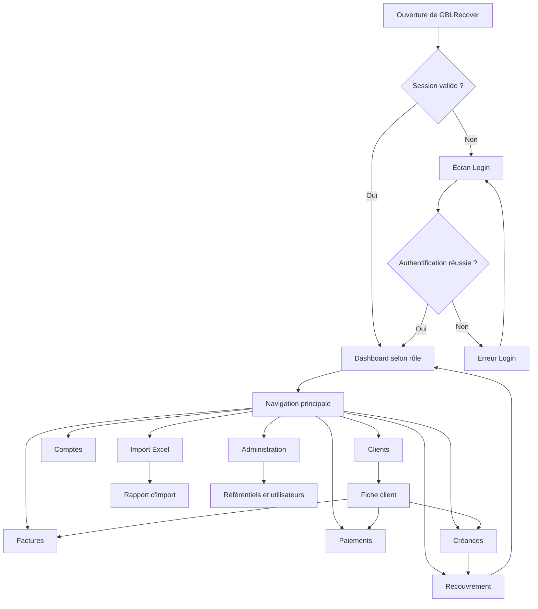

### 2.2 Architecture de navigation

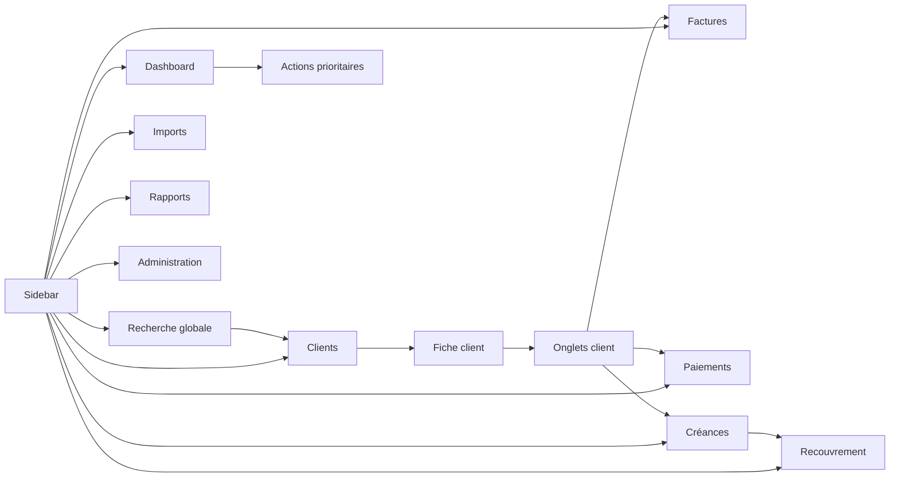

### 2.3 Shell applicatif

| Zone | Fonction |
|---|---|
| **Navbar** | Titre de contexte, recherche globale, notifications, profil |
| **Sidebar** | Navigation primaire et accès aux modules autorisés |
| **Breadcrumb** | Repérage dans les niveaux de navigation |
| **Main content** | Contenu du parcours courant |
| **Footer** | Version, aide, support et informations système |

La sidebar est persistante sur desktop et devient un drawer sur mobile. L’élément actif est toujours visible. Une page métier ne doit pas supprimer l’accès à la recherche globale lorsque celle-ci est utile pour revenir à un dossier.

---

## 3. Diagrammes décisionnels

### 3.1 Décision d’accès à une page

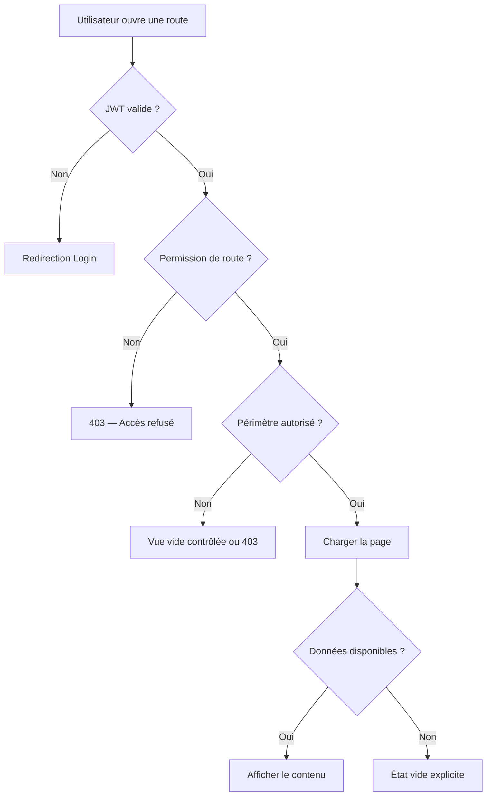

### 3.2 Décision d’enregistrement d’une action

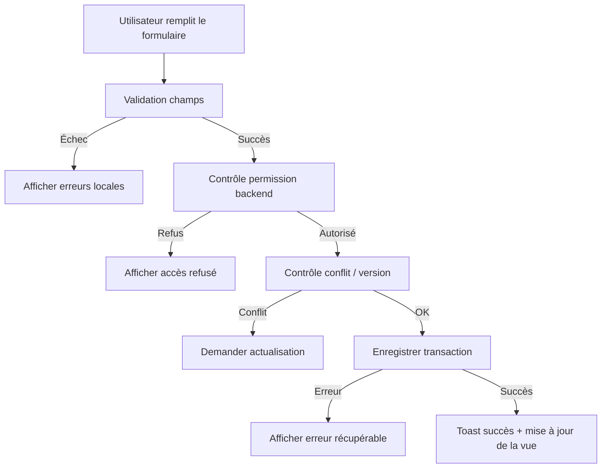

### 3.3 Décision d’import Excel

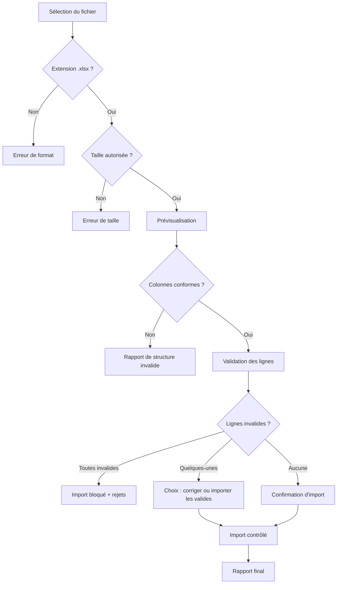

---

## 4. Parcours Login

### 4.1 Objectif

Permettre à un utilisateur autorisé de démarrer une session de manière sécurisée, comprendre immédiatement un échec et atteindre son espace de travail sans étape inutile.

### 4.2 Parcours nominal

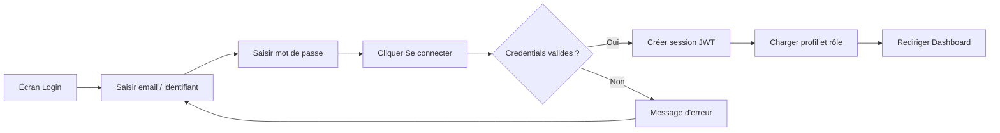

### 4.3 Règles UX

Le bouton est désactivé uniquement pendant la soumission. L’utilisateur peut afficher ou masquer le mot de passe. Les erreurs ne révèlent pas si l’identifiant existe. Après plusieurs tentatives échouées, le système affiche un message adapté à la politique de sécurité sans exposer de détail exploitable.

| État | Comportement |
|---|---|
| Initial | Champs vides, CTA disponible après saisie minimale |
| Loading | CTA en état de progression, double soumission interdite |
| Échec | Message global + erreurs de champs si pertinentes |
| Succès | Transition vers dashboard selon rôle |
| Session expirée | Retour Login avec message de session expirée |
| Compte désactivé | Message neutre et indication de contacter l’administrateur |

---

## 5. Parcours Dashboard

### 5.1 Objectif

Donner une vision immédiate du périmètre de responsabilité et orienter l’utilisateur vers les dossiers ou actions nécessitant son attention.

### 5.2 Parcours

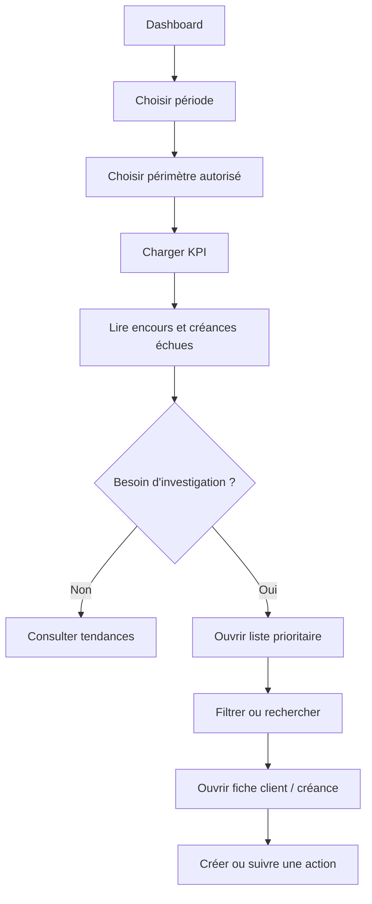

### 5.3 Contenu attendu

| Zone | Contenu |
|---|---|
| En-tête | Période, périmètre, date de mise à jour |
| KPI | Encours total, échues, taux de recouvrement, actions en retard |
| Tendances | Évolution de la dette et des encaissements |
| Aging | Créances par ancienneté |
| Priorités | Dossiers à fort montant, très anciens ou en retard d’action |
| Actions rapides | Rechercher client, importer, consulter portefeuille |

Le dashboard conserve les filtres lorsqu’un utilisateur revient depuis une fiche, sauf demande explicite de réinitialisation.

---

## 6. Parcours Client

### 6.1 Accéder à un client

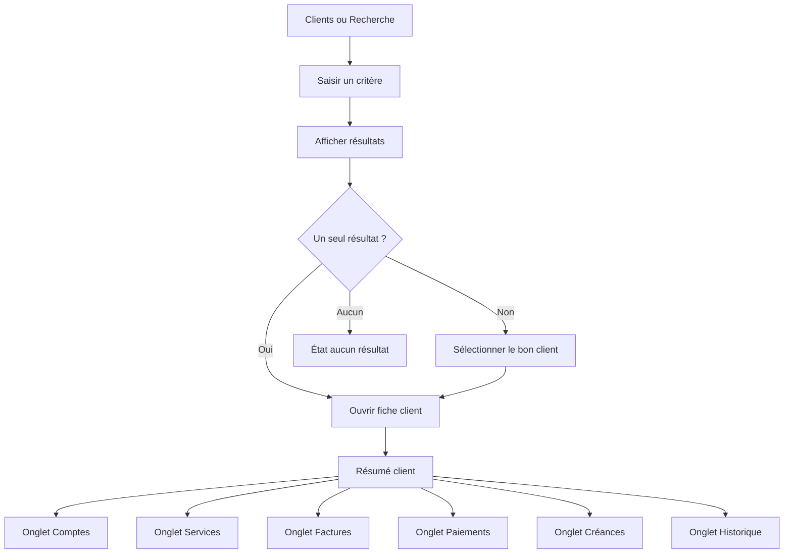

### 6.2 Fiche client

La fiche client présente une vue consolidée, mais chaque donnée doit conserver son contexte. Le résumé comprend identité, statut, contacts, agence, centre, gestionnaire, solde, dernières actions et date de fraîcheur.

| Onglet | Action utilisateur |
|---|---|
| Résumé | Comprendre la situation générale |
| Comptes | Passer d’un compte à l’autre |
| Services | Relier les services aux comptes |
| Factures | Ouvrir le détail d’une facture |
| Paiements | Vérifier les règlements et imputations |
| Créances | Identifier les montants dus et leur ancienneté |
| Historique | Comprendre les actions déjà réalisées |

### 6.3 Règles de contexte

Le nom ou identifiant client reste visible dans l’en-tête de la fiche. Les onglets conservent leur sélection lors d’un retour depuis un détail. Le bouton de retour revient à la liste précédente avec ses filtres et sa pagination lorsque cela est techniquement possible.

---

## 7. Parcours Facture

### 7.1 Consultation

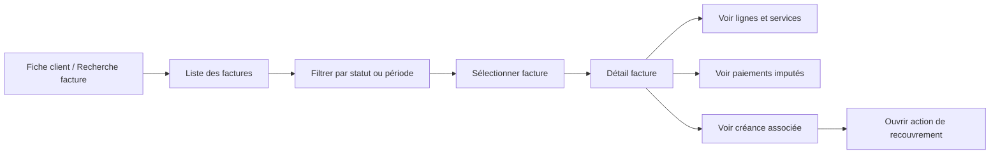

Le détail affiche numéro, compte, dates, montant initial, montant réglé, solde, statut et origine. La composition du montant est lisible et les valeurs arrondies suivent une règle unique sur toute l’application.

### 7.2 Décision d’action sur facture

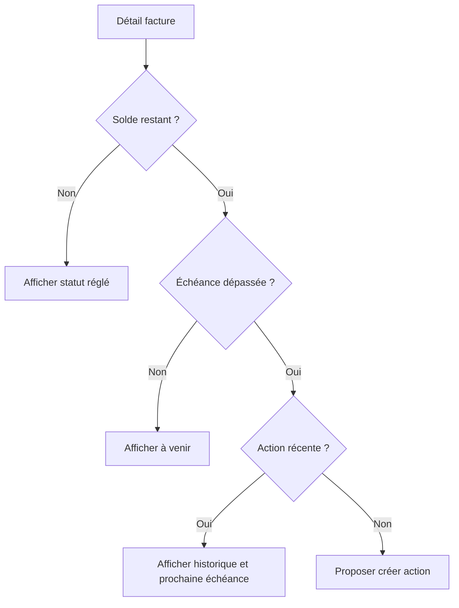

---

## 8. Parcours Paiement

### 8.1 Consultation et rapprochement

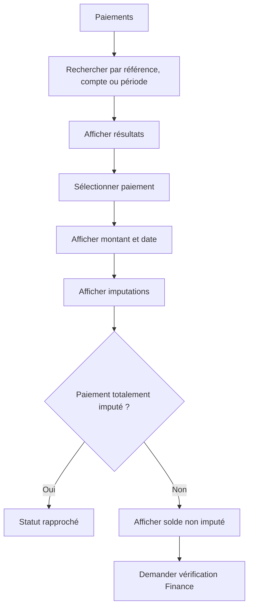

Les utilisateurs qui n’ont pas de permission d’écriture consultent les paiements en lecture seule. Les opérations de correction ou d’imputation sont contrôlées par une permission spécifique et nécessitent une trace d’audit.

### 8.2 États paiement

| État | Présentation |
|---|---|
| Reçu | Paiement enregistré, imputation à vérifier si nécessaire |
| Partiellement imputé | Montant imputé et reliquat visibles |
| Totalement imputé | Indication de rapprochement complet |
| En anomalie | Alerte et action de vérification |
| Inconnu | Information de source manquante, sans interprétation automatique |

---

## 9. Parcours Recherche

### 9.1 Recherche globale

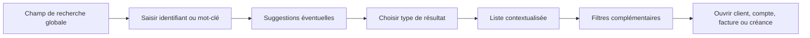

Les critères peuvent inclure identifiant client, nom, numéro de compte, numéro de facture, référence de paiement ou téléphone normalisé, selon les données disponibles et les permissions.

### 9.2 Recherche sans résultat

Le message indique le critère recherché, propose de vérifier l’orthographe ou le format et permet de réinitialiser la recherche. Il ne doit pas confirmer l’existence d’un enregistrement auquel l’utilisateur n’a pas accès.

### 9.3 Recherche avancée

La recherche avancée permet de combiner critères sans créer un formulaire disproportionné. Les filtres actifs apparaissent sous forme de chips supprimables. Un bouton réinitialise tous les critères et une option peut enregistrer une recherche favorite si cette fonction est retenue.

---

## 10. Parcours Filtrage

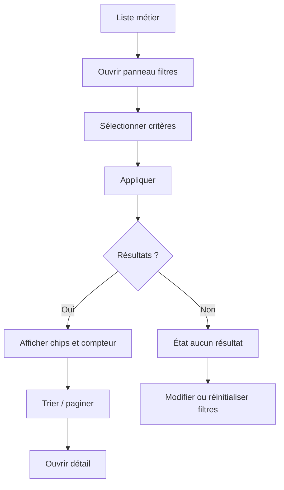

### 10.1 Règles

Les filtres sont appliqués explicitement sur desktop lorsque la requête est coûteuse ; les filtres simples peuvent être réactifs. Le nombre de résultats et la date de rafraîchissement sont visibles. Les filtres incompatibles sont signalés avant exécution. La pagination est réinitialisée à la première page après modification significative d’un filtre.

---

## 11. Parcours Import Excel

### 11.1 Parcours nominal

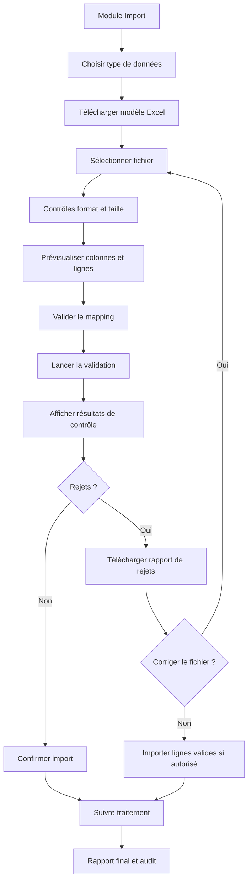

### 11.2 Principes UX

L’utilisateur connaît dès le départ le type de données attendu, le format, les colonnes obligatoires et la taille maximale. La validation précède l’import définitif. Les erreurs indiquent ligne, colonne, valeur problématique et correction suggérée. Un import en cours ne peut pas être relancé par double clic.

### 11.3 États d’import

| État | Message et action |
|---|---|
| Non sélectionné | « Sélectionnez un fichier Excel conforme. » |
| Validation | Progression et possibilité d’attendre ou quitter sans annuler silencieusement |
| Rejets partiels | Résumé accepté/rejeté + rapport téléchargeable |
| Échec | Cause générale, identifiant de lot et option de réessai contrôlé |
| Succès | Volume importé, durée et lien vers les données concernées |

---

## 12. Parcours Gestionnaire

### 12.1 Gestion d’un portefeuille

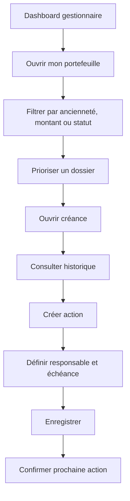

### 12.2 Affectation

Le responsable de centre peut affecter ou réaffecter un dossier uniquement dans son périmètre. L’interface affiche l’utilisateur cible, sa structure et, si disponible, une information de charge. Toute réaffectation est auditée et peut nécessiter un commentaire.

### 12.3 Suivi d’action

Une action possède un type, un statut, une date, un responsable, une note et un résultat. Les transitions sont contrôlées : une action clôturée ne redevient pas active sans permission spécifique ou création d’une nouvelle action.

---

## 13. Parcours Administration

### 13.1 Navigation administrative

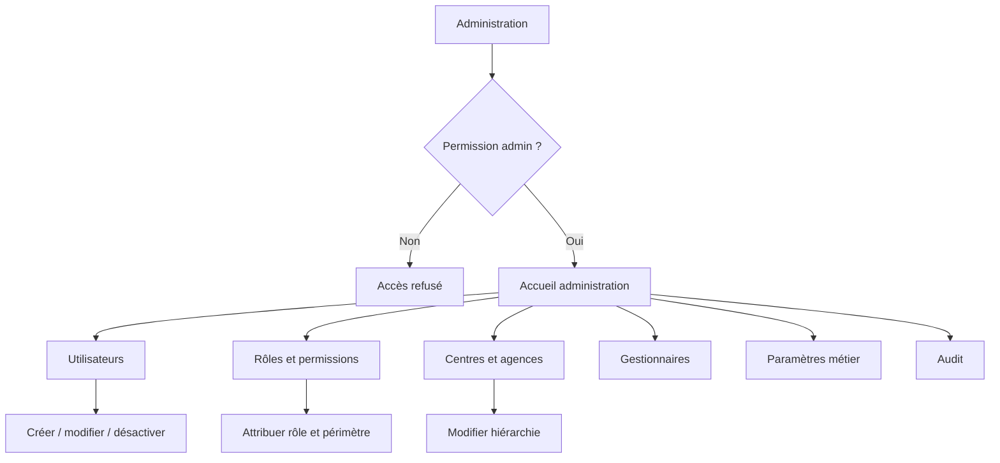

Les écrans d’administration sont séparés des écrans opérationnels. Les changements sensibles affichent l’impact, demandent une confirmation et enregistrent l’acteur, la date, la valeur précédente et la nouvelle valeur.

### 13.2 Désactivation d’un utilisateur

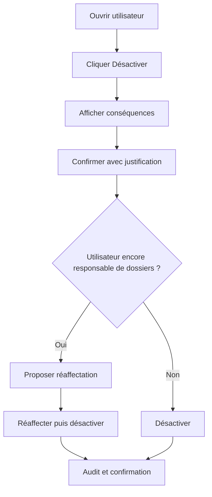

---

## 14. Permissions

### 14.1 Modèle d’accès

Les permissions combinent un rôle et un périmètre. L’interface masque ou désactive les actions non autorisées, mais l’API demeure la seule autorité de sécurité.

| Rôle | Dashboard | Clients | Créances | Actions | Imports | Administration |
|---|---:|---:|---:|---:|---:|---:|
| Agent | Lecture portefeuille | Lecture | Lecture portefeuille | Créer / suivre | Non ou limité | Non |
| Responsable centre | Centre | Centre | Centre | Affecter / suivre | Selon politique | Non |
| Manager Revenue Assurance | Transverse | Transverse | Transverse | Superviser | Oui | Non |
| Finance | KPI autorisés | Lecture | Lecture | Lecture | Selon politique | Non |
| Admin fonctionnel | Oui | Selon besoin | Selon besoin | Paramétrer | Oui | Référentiels |
| Admin sécurité | Oui | Selon besoin | Selon besoin | Audit | Non | Utilisateurs / rôles |
| Auditeur | Lecture | Lecture autorisée | Lecture autorisée | Lecture audit | Lecture résultats | Lecture audit |

### 14.2 UX des permissions

Une action interdite ne doit pas produire un faux parcours : elle doit être absente, désactivée avec explication ou remplacée par une action de demande d’accès selon le contexte. Une donnée hors périmètre ne doit pas être révélée par le compteur, l’autocomplétion ou un message d’erreur trop précis.

---

## 15. Cas d’erreur

### 15.1 Catalogue d’erreurs UX

| Situation | Message recommandé | Action proposée |
|---|---|---|
| API indisponible | « Le service est temporairement indisponible. » | Réessayer |
| Session expirée | « Votre session a expiré. Connectez-vous à nouveau. » | Retour Login |
| Accès refusé | « Vous n’avez pas accès à cette information. » | Retour au périmètre autorisé |
| Conflit de modification | « Cette donnée a été modifiée depuis son ouverture. » | Actualiser et comparer |
| Timeout | « La réponse prend plus de temps que prévu. » | Réessayer ou revenir |
| Import invalide | « Le fichier ne respecte pas le modèle attendu. » | Télécharger modèle / corriger |
| Erreur inconnue | « Une erreur est survenue. » | Request ID + support |

### 15.2 Règles d’affichage

Une erreur globale est affichée au niveau de la page ou de la zone concernée. Une erreur de champ apparaît près du champ. Une erreur de mutation conserve les données saisies lorsque cela ne crée pas de risque. Les messages techniques comme stack trace, code SQL ou noms de services ne sont jamais visibles à l’utilisateur.

---

## 16. Cas vides

Un état vide explique la situation et donne une prochaine action lorsque celle-ci existe.

| Cas | Contenu |
|---|---|
| Première utilisation | Explication courte + action de démarrage |
| Aucun client | « Aucun client ne correspond à ces critères. » + modifier filtres |
| Aucun paiement | Message contextualisé par période ou compte |
| Aucune créance | Indication que le périmètre ne contient pas de dette ouverte |
| Aucun résultat après filtre | Résumé des filtres actifs + réinitialiser |
| Aucun historique | « Aucune action enregistrée pour le moment. » |
| Aucun import | Guide court + télécharger modèle |
| Accès limité | Message neutre sans révéler les données cachées |

Les illustrations sont fonctionnelles et discrètes. Elles ne doivent pas suggérer une erreur lorsque l’absence de données est normale.

---

## 17. Cas de chargement

### 17.1 Principes

Le chargement doit être perceptible sans être anxiogène. Le squelette respecte la structure finale, les listes affichent leur nombre de lignes attendu si connu et les boutons de mutation montrent une progression sans changer de largeur.

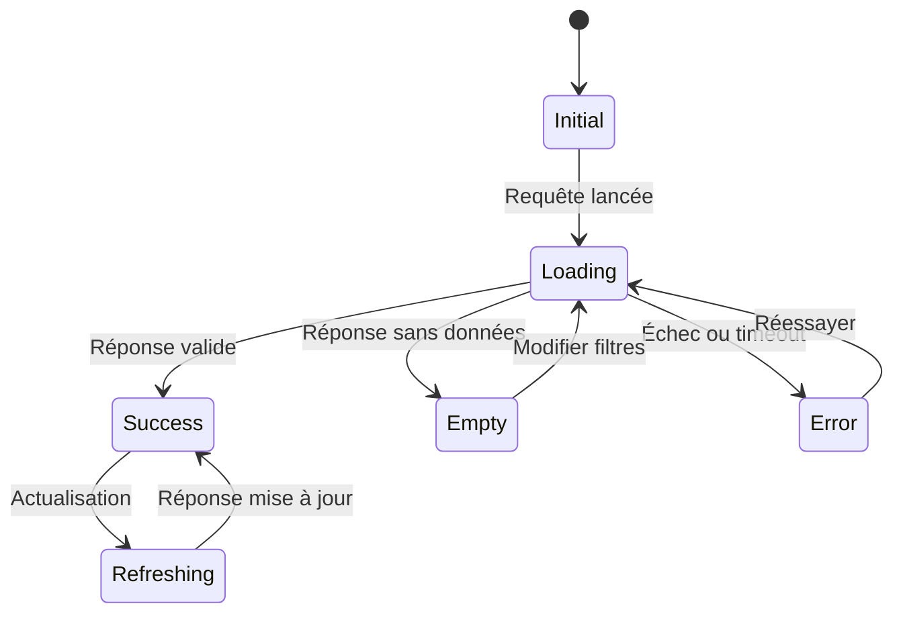

### 17.2 Règles

Les chargements de page utilisent un skeleton ; les actions locales utilisent un spinner ou un état progressif. Une requête lente affiche un message après un délai raisonnable. Toute opération longue, notamment l’import, affiche un statut persistant et récupérable.

---

## 18. Transitions

### 18.1 Transitions de navigation

Les transitions doivent préserver le contexte et éviter les mouvements inutiles. Une navigation standard peut être instantanée ou utiliser un fondu très court. Les modales et drawers utilisent une transition courte et respectent la réduction de mouvement.

| Transition | Comportement |
|---|---|
| Liste → détail | Ouverture directe, breadcrumb mis à jour |
| Détail → liste | Retour aux filtres et à la position précédente si possible |
| Onglet → onglet | Changement immédiat, chargement local si nécessaire |
| Filtre → résultats | Indicateur de rafraîchissement local |
| Création → détail | Confirmation puis ouverture de l’objet créé |
| Session expirée → Login | Message de contexte et retour sécurisé |
| Import → rapport | Statut persistant puis résultat détaillé |

### 18.2 Transitions métier

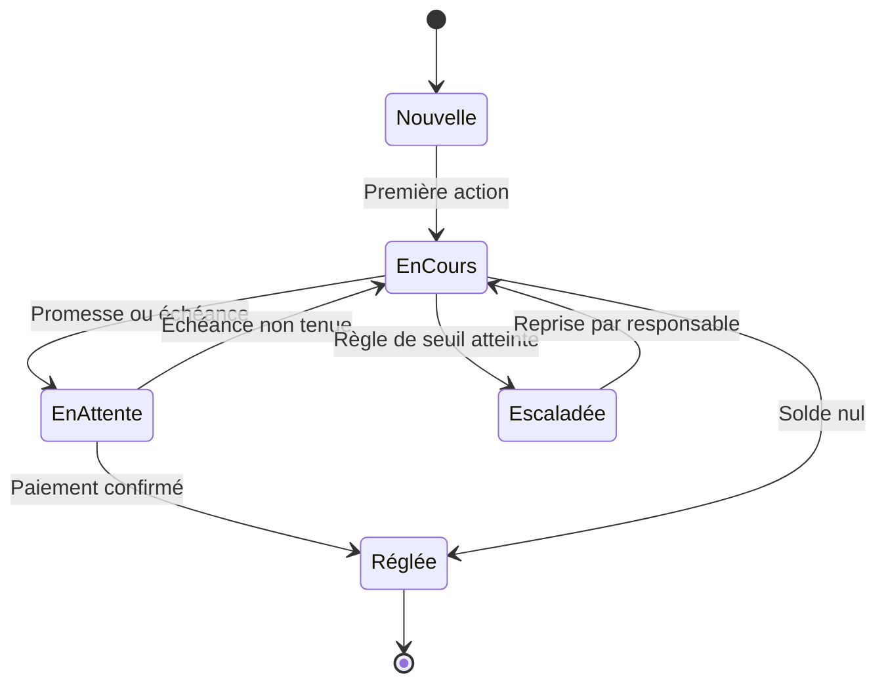

Les transitions visibles doivent correspondre aux statuts réellement autorisés par le backend. Une animation ne doit jamais masquer un changement d’état critique.

---

## 19. Navigation clavier et retour arrière

Le parcours doit rester cohérent avec les conventions du navigateur. Le bouton retour ne doit pas provoquer une perte silencieuse de saisie ; lorsqu’une saisie non enregistrée existe, un avertissement est affiché. Les modales se ferment avec Escape et restituent le focus au contrôle qui les a ouvertes.

Les filtres et la pagination peuvent être reflétés dans l’URL lorsque cela facilite le partage, la restauration ou la navigation arrière. Les données sensibles ne doivent pas être exposées dans des paramètres d’URL non nécessaires.

---

## 20. Principes de validation UX

| Critère | Question |
|---|---|
| Orientation | L’utilisateur sait-il dans quel module et quel dossier il se trouve ? |
| Progression | Comprend-il ce qui se passe pendant un chargement ou un import ? |
| Décision | Les choix et conséquences sont-ils explicites ? |
| Sécurité | Une action interdite ou destructive est-elle correctement contrôlée ? |
| Récupération | Peut-il corriger une erreur sans recommencer inutilement ? |
| Continuité | Le contexte est-il conservé entre liste, détail et retour ? |
| Accessibilité | Le parcours est-il possible au clavier et sans couleur seule ? |
| Cohérence | Le même composant se comporte-t-il de la même manière partout ? |

---

## Conclusion

Les parcours utilisateurs de GBLRecover sont structurés autour de la recherche rapide, de la compréhension consolidée du client et de la capacité à agir sur les créances. La navigation fournit un cadre stable ; les diagrammes décisionnels rendent explicites les conditions d’accès et de traitement ; les états d’erreur, de chargement et d’absence de données garantissent une expérience robuste au-delà du parcours nominal.

Toute nouvelle fonctionnalité doit être intégrée à cet App Flow, déclarer son point d’entrée, son point de sortie, ses permissions, ses états et ses transitions. Aucun écran ne doit être conçu comme une destination isolée du système de navigation.

## Références

Ce document est une spécification UX interne élaborée pour GBLRecover à partir du contexte produit et des besoins de navigation fournis. Les rôles, permissions, statuts et seuils métier définitifs devront être confirmés par CAMTEL avant implémentation.
