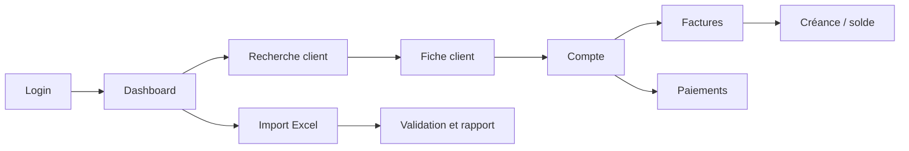
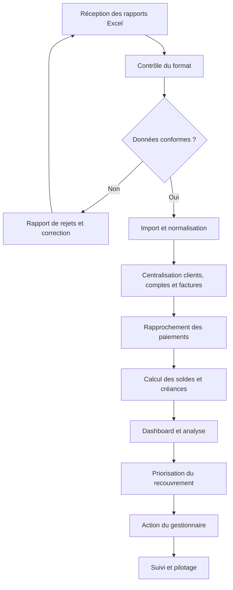
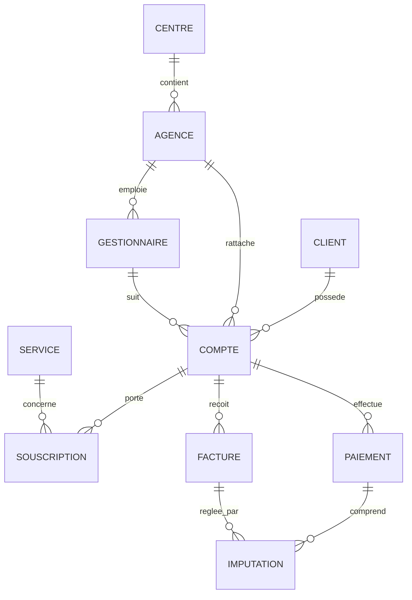
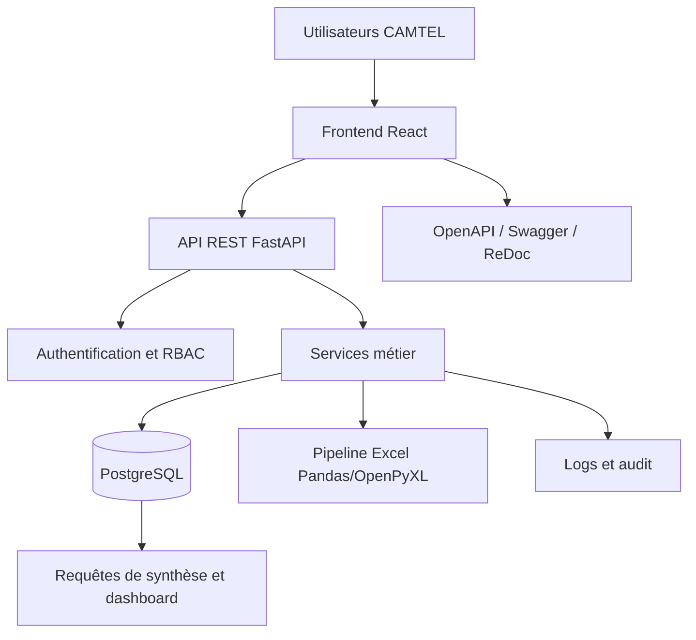

# GBLContext

## Document fondateur et source unique de vérité de GBLRecover

| Métadonnée | Valeur |
|---|---|
| **Projet** | GBLRecover |
| **Organisation** | CAMTEL |
| **Département sponsor** | Revenue Assurance |
| **Type de solution** | Plateforme Web Enterprise |
| **Document** | GBLContext.md |
| **Rôle** | Document fondateur et Single Source of Truth |
| **Version** | 1.0 |
| **Statut** | Référence officielle de cadrage |
| **MVP** | 7 jours |
| **Équipe de réalisation** | 1 Architecte Logiciel / Tech Lead et 5 Développeurs Full Stack Junior |
| **Langue** | Français professionnel |
| **Date** | 7 août 2026 |

> **Règle de gouvernance.** Toute décision fonctionnelle, technique, UX, data, sécurité ou de livraison doit rester cohérente avec ce document. Lorsqu’une information est inconnue, elle doit être explicitement classée comme **hypothèse** ou **question ouverte**, et non transformée en fait implicite.

---

# 1. Présentation du projet

GBLRecover est une plateforme web destinée au service Revenue Assurance de CAMTEL. Elle centralise les données relatives aux clients, comptes, centres de gestion, agences, gestionnaires, services, factures, paiements, créances et balances afin de faciliter le recouvrement et d’améliorer le pilotage de la dette.

Le projet répond à une situation dans laquelle les rapports de facturation sont principalement manipulés sous Excel. Cette organisation rend les analyses plus longues, augmente le risque d’incohérence et limite la disponibilité d’une vision consolidée des créances.

GBLRecover doit fournir une base applicative claire, progressive et exploitable en entreprise, sans introduire une complexité disproportionnée par rapport au délai de livraison du MVP.

---

# 2. Résumé exécutif

GBLRecover transforme des données de facturation dispersées en une plateforme métier orientée décision. Le MVP doit permettre d’importer des données Excel, de consulter un portefeuille client, d’identifier les factures et paiements, de visualiser les créances et de suivre des indicateurs de pilotage.

La stratégie de réalisation repose sur une architecture modulaire avec un frontend React, une API FastAPI, une base PostgreSQL et un pipeline d’import Pandas/OpenPyXL. Le périmètre de sept jours impose un **vertical slice** cohérent plutôt qu’une couverture superficielle de toutes les fonctionnalités possibles.

| Dimension | Décision fondatrice |
|---|---|
| Priorité | Compréhension métier et qualité des données avant sophistication technique |
| Livraison | MVP démontrable et déployé en sept jours |
| Architecture | Frontend séparé, API REST modulaire et base relationnelle |
| Données | Import contrôlé, validation, traçabilité et identifiants sources |
| UX | Recherche rapide, dashboard décisionnel et parcours orientés action |
| Évolution | Préparer les extensions sans les implémenter prématurément |

---

# 3. Vision produit

> **GBLRecover doit devenir le point de référence opérationnel pour comprendre la dette client, prioriser les actions de recouvrement et piloter la performance Revenue Assurance.**

La plateforme ne se limite pas à afficher des données. Elle doit permettre de passer rapidement de l’information à l’action : retrouver un client, comprendre son exposition, vérifier ses factures et paiements, identifier les montants échus et suivre la prochaine action attendue.

### 3.1 Promesse produit

**Voir juste. Comprendre vite. Agir avec confiance.**

### 3.2 Critères de cohérence produit

Toute nouvelle fonctionnalité doit répondre à au moins une des questions suivantes :

1. Facilite-t-elle la compréhension d’une situation client ou financière ?
2. Réduit-elle un traitement manuel ou une source d’erreur ?
3. Aide-t-elle à prioriser ou suivre le recouvrement ?
4. Améliore-t-elle la qualité, la fraîcheur ou la traçabilité des données ?
5. Fournit-elle une capacité de pilotage utile à Revenue Assurance ?

---

# 4. Vision métier

Revenue Assurance cherche à réduire les fuites de revenus, améliorer la qualité des données de facturation et maîtriser les créances. GBLRecover s’inscrit dans cette mission en centralisant les informations nécessaires au suivi de la dette.

La vision métier est d’évoluer d’une gestion fondée sur des fichiers et des rapprochements manuels vers un système de pilotage structuré, historisé et partagé.

| Situation actuelle | Situation cible |
|---|---|
| Rapports Excel dispersés | Base de données centralisée |
| Analyses manuelles | KPI et filtres réutilisables |
| Recherche par fichier | Recherche client et compte unifiée |
| Lecture isolée des factures | Vue consolidée facture-paiement-créance |
| Suivi difficile des actions | Portefeuille et priorités visibles |
| Connaissance tacite | Règles et données documentées |

---

# 5. Contexte métier

Le département Revenue Assurance exploite des rapports de facturation pour suivre les créances clients, faciliter le recouvrement et améliorer la maîtrise des revenus. Les catégories de données identifiées sont les suivantes :

- Clients ;
- Comptes ;
- Centres de gestion ;
- Agences ;
- Gestionnaires ;
- Services ;
- Souscriptions ;
- Factures ;
- Paiements ;
- Créances ;
- Balances.

Le modèle de données doit distinguer les référentiels, les entités contractuelles et les événements financiers. Les valeurs financières doivent rester explicables et rapprochables avec les sources Excel ou les systèmes existants.

> **Point de vigilance.** La définition exacte de « balance », de « créance » et des règles d’imputation doit être confirmée avec les responsables métier avant tout traitement financier de production.

---

# 6. Problématique

Les fichiers Excel sont utiles pour l’échange et l’analyse ponctuelle, mais ils deviennent fragiles lorsqu’ils servent de système principal de suivi. Les risques identifiés sont la duplication des versions, les erreurs de saisie, l’absence de traçabilité, la difficulté à maintenir les filtres et la faible visibilité sur la fraîcheur des données.

La problématique centrale est donc la suivante :

> **Comment centraliser, fiabiliser et rendre actionnables les données de facturation et de créances afin que Revenue Assurance puisse mieux piloter la dette et le recouvrement ?**

---

# 7. Objectifs Business

| Objectif | Résultat attendu |
|---|---|
| Faciliter le recouvrement | Les gestionnaires identifient les dossiers prioritaires et leur prochaine action |
| Maîtriser la dette | Les montants dus, échus et non réglés sont consolidés |
| Améliorer le pilotage des revenus | Les responsables disposent d’indicateurs partagés |
| Fournir une vision consolidée | Les données client, compte, facture et paiement sont reliées |
| Réduire les traitements manuels | Les imports et validations sont standardisés |
| Améliorer la qualité des analyses | Les données sont filtrables, historisées et contrôlées |

---

# 8. Objectifs Produit

Le MVP doit :

1. permettre à un utilisateur autorisé de se connecter ;
2. afficher un dashboard de synthèse adapté à son périmètre ;
3. rechercher un client, un compte, une facture ou un paiement ;
4. consulter une fiche client consolidée ;
5. visualiser les factures, paiements et soldes associés ;
6. importer un rapport Excel avec validation et rapport de rejets ;
7. appliquer des permissions par rôle et périmètre ;
8. exposer une API documentée et une base PostgreSQL versionnée ;
9. fournir des états d’erreur, de chargement et d’absence de données ;
10. être déployable et démontrable dans le délai de sept jours.

---

# 9. Périmètre du MVP

### 9.1 Inclus

| Domaine | Fonctionnalités MVP |
|---|---|
| Authentification | Login, JWT, session et rôles de base |
| Dashboard | KPI, dette, créances échues, liste prioritaire |
| Clients | Recherche, liste, fiche et comptes associés |
| Factures | Consultation, statut, montant total, payé et restant dû |
| Paiements | Consultation, référence, montant et imputation disponible |
| Import | Fichier Excel, validation, prévisualisation et rejets |
| Organisation | Centres, agences et gestionnaires en lecture ou administration limitée |
| API | Endpoints REST versionnés et documentation OpenAPI |
| Qualité | Tests essentiels, CI/CD, logs et healthcheck |

### 9.2 Vertical slice de démonstration



---

# 10. Hors périmètre — V2

Les fonctionnalités suivantes sont explicitement reportées :

- notifications email, SMS ou omnicanales ;
- workflow complet de recouvrement et d’escalade ;
- intégrations temps réel avec tous les systèmes CAMTEL ;
- scoring prédictif des créances ;
- intelligence artificielle générative opérationnelle ;
- application mobile native ;
- data warehouse complet ;
- exports et rapports planifiés avancés ;
- moteur de règles configurable par les utilisateurs ;
- prévisions financières avancées ;
- automatisation complète des relances.

Le report ne signifie pas que ces fonctionnalités sont abandonnées. Elles doivent être évaluées après validation de l’usage réel du MVP et de la qualité des données disponibles.

---

# 11. Parties prenantes

| Partie prenante | Responsabilité / intérêt |
|---|---|
| Direction CAMTEL | Orientation, arbitrage et sponsor institutionnel |
| Revenue Assurance | Propriétaire métier principal et utilisateur de référence |
| Finance | Rapprochement, facturation, paiements et qualité financière |
| Responsables de centres | Pilotage territorial et supervision |
| Responsables d’agences | Gestion opérationnelle des portefeuilles |
| Gestionnaires | Consultation et actions de recouvrement |
| DSI | Architecture, sécurité, exploitation et intégration |
| Équipe projet | Conception, développement, tests et livraison |
| Utilisateurs pilotes | Validation des parcours et feedback |

---

# 12. Personas

### 12.1 Agent ou gestionnaire de recouvrement

Il consulte un portefeuille de comptes, recherche des clients, analyse les factures échues et suit les actions réalisées. Il a besoin de rapidité, de filtres et d’une vue claire de la prochaine action.

### 12.2 Responsable d’agence

Il supervise les comptes de son agence, compare les montants, identifie les retards et suit la performance de son équipe. Il a besoin d’un dashboard et d’une vue agrégée par portefeuille.

### 12.3 Responsable Revenue Assurance

Il analyse les tendances globales, la dette, les anomalies et les performances de recouvrement. Il a besoin d’indicateurs consolidés, de comparaisons et d’une information fiable sur la fraîcheur des données.

### 12.4 Analyste Finance

Il vérifie les factures, paiements et imputations. Il a besoin d’une traçabilité des montants, d’une recherche précise et d’une limitation des modifications non autorisées.

### 12.5 Administrateur fonctionnel

Il gère les référentiels, utilisateurs, rôles et périmètres. Il a besoin d’actions contrôlées, d’un audit et de confirmations explicites.

---

# 13. Processus métier global



### 13.1 Principes du processus

L’import ne doit pas écraser silencieusement une donnée existante. Les identifiants sources permettent de détecter les doublons et de rendre les traitements aussi idempotents que possible. Les erreurs de ligne sont isolées, documentées et téléchargeables.

---

# 14. Cartographie des données



### 14.1 Sources et usages

| Donnée | Source probable | Usage |
|---|---|---|
| Client | Rapport ou système client | Identification et regroupement |
| Compte | Système de facturation | Solde et rattachement |
| Agence / centre | Référentiel organisationnel | Périmètre et pilotage |
| Gestionnaire | Référentiel RH ou métier | Affectation et responsabilité |
| Service | Catalogue d’offres | Souscription et facturation |
| Facture | Système de facturation | Dette et échéance |
| Paiement | Système financier ou bancaire | Encaissement et rapprochement |
| Balance | Rapport calculé ou source financière | Contrôle et synthèse |

---

# 15. Entités métier principales

| Entité | Définition | Relations principales |
|---|---|---|
| Client | Personne ou organisation titulaire de comptes | Possède un ou plusieurs comptes |
| Compte | Unité contractuelle ou financière | Appartient à un client, agence et éventuellement gestionnaire |
| Gestionnaire | Responsable d’un portefeuille | Rattaché à une agence, suit des comptes |
| Agence | Unité opérationnelle | Appartient à un centre et rattache des comptes |
| Centre | Niveau organisationnel supérieur | Regroupe des agences |
| Service | Offre ou prestation CAMTEL | Est lié à une souscription |
| Souscription | Association d’un compte et d’un service | Porte périodes, statut et tarif |
| Facture | Document financier émis | Appartient à un compte, peut être réglée |
| Paiement | Encaissement reçu | Appartient à un compte, peut être imputé |
| Créance | Montant restant dû | Dérivée des factures non soldées selon règle métier |
| Balance | Vision agrégée des débits et crédits | À confirmer selon le système source |

---

# 16. Glossaire métier

| Terme | Définition de travail |
|---|---|
| **Revenue Assurance** | Fonction visant à protéger les revenus et réduire les pertes ou anomalies de facturation |
| **Client** | Titulaire d’un compte ou de plusieurs comptes |
| **Compte** | Référence financière ou contractuelle utilisée pour rattacher services, factures et paiements |
| **Service** | Offre ou prestation consommée ou souscrite |
| **Souscription** | Relation entre un compte et un service pendant une période donnée |
| **Facture** | Document indiquant un montant dû et une date d’échéance |
| **Paiement** | Montant encaissé pour un compte |
| **Imputation** | Association d’un paiement à une facture |
| **Créance** | Montant restant dû après prise en compte des paiements validés |
| **Balance** | État synthétique des montants débités, crédités ou restant dus ; définition détaillée à confirmer |
| **Centre** | Niveau organisationnel regroupant des agences |
| **Agence** | Unité opérationnelle rattachée à un centre |
| **Gestionnaire** | Personne responsable du suivi d’un portefeuille |
| **Encours** | Montant non soldé à une date donnée |
| **Échéance** | Date à laquelle une facture devient exigible |
| **Source système** | Système ou rapport depuis lequel une donnée est importée |
| **Périmètre** | Ensemble de données auxquelles un utilisateur a accès |

---

# 17. Règles métier connues

1. Un client peut posséder plusieurs comptes.
2. Un compte appartient à un seul client.
3. Un compte est rattaché à une agence et à un périmètre organisationnel.
4. Une agence appartient à un centre.
5. Un compte peut être affecté à un gestionnaire.
6. Un compte peut souscrire à plusieurs services.
7. Une facture appartient à un compte.
8. Un paiement appartient à un compte.
9. Un paiement peut être imputé à une ou plusieurs factures.
10. Une facture ne peut pas être imputée au-delà de son montant total.
11. Un paiement ne peut pas être imputé au-delà de son montant disponible.
12. Une facture annulée ne doit pas recevoir de nouvelle imputation.
13. Les montants doivent être représentés avec une précision décimale appropriée.
14. Les imports doivent préserver les identifiants sources et produire des rejets explicables.
15. Les permissions doivent être vérifiées côté backend, même si l’interface masque une action.
16. Les données financières ne doivent pas être supprimées physiquement sans règle d’archivage validée.

---

# 18. Hypothèses

Les éléments suivants sont des hypothèses de travail et non des décisions métier définitivement validées :

| Hypothèse | Conséquence |
|---|---|
| Les rapports Excel disposent d’identifiants stables | Les imports pourront être rapprochés et dédoublonnés |
| Un compte possède une agence de rattachement principale | Le filtrage organisationnel peut être appliqué |
| Les paiements peuvent être associés à des factures | Une table d’imputation peut être utilisée |
| Les données initiales sont disponibles sous forme anonymisée ou contrôlée | Le MVP peut être démontré sans exposer de données sensibles |
| Les règles de devise sont compatibles au sein d’un compte | Les contrôles financiers peuvent être simplifiés dans le MVP |
| Les utilisateurs peuvent être identifiés par un compte applicatif | JWT et RBAC peuvent être mis en œuvre sans SSO initial |
| Les KPI du MVP sont calculables à partir des données importées | Le dashboard peut fonctionner sans data warehouse |
| Le périmètre de sept jours vise un MVP démontrable | Les fonctions avancées sont reportées |

Toute hypothèse invalidée doit produire une mise à jour de ce document ou un ADR associé.

---

# 19. Questions ouvertes

| Question | Propriétaire de la réponse | Impact |
|---|---|---|
| Quelle est la définition officielle de la balance ? | Revenue Assurance / Finance | Modèle de données et KPI |
| Quelle est la source de vérité pour les paiements ? | Finance / DSI | Rapprochement et qualité |
| Les identifiants client et compte sont-ils stables ? | DSI | Imports et intégrations |
| Quelles règles déterminent une créance échue ? | Finance | KPI et priorisation |
| Les montants peuvent-ils utiliser plusieurs devises ? | Finance | Contraintes et calculs |
| Quel SSO ou annuaire sera utilisé à terme ? | DSI | Authentification |
| Quels rôles et périmètres doivent être livrés au MVP ? | Métier / DSI | RBAC et navigation |
| Quelle taille maximale pour un fichier Excel ? | DSI / métier | Pipeline d’import |
| L’import doit-il accepter les lignes valides malgré des rejets ? | Revenue Assurance | UX et transaction |
| Quelles politiques d’archivage et de rétention s’appliquent ? | DSI / juridique | Base et audit |
| Quelles intégrations CAMTEL sont prioritaires après le MVP ? | Sponsor / DSI | Roadmap V2 |

---

# 20. Architecture fonctionnelle — vue macro



### 20.1 Découpage fonctionnel

| Couche | Responsabilité |
|---|---|
| Interface | Navigation, recherche, filtres, formulaires, visualisations |
| API | Contrats REST, validation, autorisation et sérialisation |
| Domaine | Règles client, compte, facture, paiement et créance |
| Persistance | Modèles relationnels, migrations, index et transactions |
| Import | Lecture, mapping, validation, rejets et idempotence |
| Exploitation | Logs, healthchecks, métriques et déploiement |

---

# 21. Stack technique officielle

### Frontend

- React 19 ;
- TypeScript ;
- Vite ;
- Tailwind CSS ;
- shadcn/ui ;
- TanStack Query pour la gestion des données serveur ;
- React Hook Form et Zod lorsque les formulaires complexes seront implémentés.

### Backend

- FastAPI ;
- Python 3.12 ;
- SQLAlchemy 2.0 ;
- Alembic ;
- Pydantic v2 ;
- Uvicorn ;
- JWT ;
- Passlib/bcrypt pour le stockage sécurisé des mots de passe.

### Base et import

- PostgreSQL 16 ;
- Pandas ;
- OpenPyXL.

### Déploiement

| Composant | Cible |
|---|---|
| Frontend | Vercel |
| Backend | Railway |
| Base de données | Railway PostgreSQL |

Toute modification de stack doit être documentée dans un ADR et justifiée par un besoin concret.

---

# 22. Principes d’architecture

1. **Business First :** le métier guide la technique.
2. **Modularité :** les domaines métier sont isolés sans créer prématurément des microservices.
3. **API-first :** les contrats REST sont définis et documentés avant l’intégration frontend.
4. **Source de vérité unique :** la base et les règles de domaine évitent les calculs contradictoires.
5. **Sécurité par défaut :** l’accès est refusé sans permission explicite.
6. **Observabilité :** les erreurs et traitements importants sont traçables.
7. **Évolutivité raisonnable :** les choix du MVP permettent une croissance progressive.
8. **Simplicité :** la solution la moins complexe qui satisfait le besoin est préférée.
9. **Réversibilité :** les décisions critiques sont documentées et les migrations maîtrisées.
10. **Qualité des données :** une donnée inconnue doit rester identifiable comme inconnue.

---

# 23. Principes UI/UX

L’interface doit être fiable, analytique, claire et pragmatique. Elle doit permettre à l’utilisateur de savoir où il se trouve, quelle donnée est prioritaire et quelle action est attendue.

| Principe | Application |
|---|---|
| Clarté | Labels explicites, titres courts et statuts lisibles |
| Hiérarchie | KPI, actions et informations secondaires clairement différenciés |
| Densité maîtrisée | Tables adaptées au métier, mais structurées et respirantes |
| Cohérence | Composants, couleurs et états réutilisés |
| Accessibilité | Focus visible, clavier, contraste et messages non dépendants de la couleur |
| États complets | Loading, empty, error, success et accès refusé |
| Responsivité | Navigation desktop et adaptation mobile contrôlée |
| Confiance | Date de fraîcheur, unités et contexte des montants |

Les couleurs fonctionnelles doivent garder un sens stable. Le rouge est réservé aux situations critiques ou destructives ; il ne sert pas de décoration.

---

# 24. Principes de sécurité

La sécurité est une exigence fonctionnelle, notamment parce que la plateforme manipule des données clients et financières.

- Toutes les routes sensibles sont protégées par authentification.
- Les permissions sont vérifiées côté backend.
- Les mots de passe ne sont jamais stockés en clair.
- Les secrets et chaînes de connexion ne sont jamais commités.
- Les logs ne doivent pas contenir de mots de passe, tokens ou données sensibles inutiles.
- Les entrées sont validées côté frontend et backend, la validation backend faisant autorité.
- Les imports sont contrôlés par type, taille, structure et contenu.
- Les données de démonstration sont fictives ou anonymisées.
- Les actions sensibles sont auditables.
- Les réponses d’erreur ne révèlent pas l’existence de données hors périmètre.

Le choix d’un SSO CAMTEL, la politique de rotation des secrets, la conservation des audits et la conformité réglementaire sont des questions ouvertes à traiter avec la DSI.

---

# 25. Principes de développement

Le code doit être organisé par domaine fonctionnel et non uniquement par type technique. Les développeurs utilisent des branches courtes, des pull requests ciblées et des revues obligatoires.

### 25.1 Conventions

| Sujet | Convention |
|---|---|
| Python | PEP 8, typage, fonctions courtes et modules par domaine |
| TypeScript | Mode strict, types explicites aux frontières et composants composables |
| API | `/api/v1`, noms pluriels, pagination et erreurs structurées |
| Base | Tables en `snake_case`, UUID, migrations Alembic |
| Git | Branches `feature/`, `fix/`, `chore/`, commits explicites |
| PR | Une intention principale, description, tests et captures si UI |
| Config | Variables d’environnement, aucune valeur secrète dans le code |
| Documentation | README, OpenAPI et ADR maintenus avec le code |

### 25.2 Architecture de projet indicative

```text
GBLRecover/
├── frontend/
│   ├── src/
│   │   ├── app/
│   │   ├── components/
│   │   ├── features/
│   │   ├── lib/
│   │   └── routes/
│   └── package.json
├── backend/
│   ├── app/
│   │   ├── api/
│   │   ├── core/
│   │   ├── db/
│   │   ├── models/
│   │   ├── schemas/
│   │   ├── services/
│   │   └── imports/
│   ├── alembic/
│   ├── tests/
│   └── pyproject.toml
├── docs/
│   ├── adr/
│   ├── ux/
│   └── data/
├── docker-compose.yml
└── README.md
```

---

# 26. Normes de qualité

Une fonctionnalité est considérée comme terminée lorsqu’elle est implémentée, revue, testée, documentée et vérifiée dans l’environnement cible.

| Domaine | Standard minimal |
|---|---|
| Fonctionnel | Parcours nominal et erreurs prévues traités |
| Code | Formatage, lint et typage passants |
| Tests | Tests pertinents ajoutés et exécutés |
| API | OpenAPI et codes HTTP documentés |
| Sécurité | Authentification, permission et validation vérifiées |
| UX | États de chargement, vide et erreur conçus |
| Données | Migration et fixtures versionnées |
| Exploitation | Logs, healthcheck et variables documentés |
| Revue | Pull request approuvée |

La qualité ne se réduit pas à la couverture de tests. Elle comprend aussi l’exactitude des données, la lisibilité du code, la sécurité, l’expérience utilisateur et la capacité à diagnostiquer une erreur.

---

# 27. Gestion des risques

| Risque | Impact | Réponse |
|---|---|---|
| Périmètre trop large pour 7 jours | Très élevé | Protéger le vertical slice et reporter les fonctions V2 |
| Données métier mal comprises | Très élevé | Ateliers courts, hypothèses explicites et validation des exemples |
| Qualité Excel insuffisante | Élevé | Modèle standard, prévisualisation et rapport de rejets |
| Exposition de données sensibles | Très élevé | Fixtures anonymisées, RBAC et revue sécurité |
| Intégration tardive frontend/backend | Élevé | Contrats API précoces et intégration dès le Jour 3 |
| Juniorité de l’équipe | Élevé | Pairing, tâches petites et revue rapide de l’architecte |
| Déploiement instable | Élevé | Staging avant Jour 6, healthcheck et rollback |
| Règles KPI ambiguës | Élevé | Afficher les définitions et classer les décisions ouvertes |
| Performance des agrégations | Moyen | Index, pagination et mesures avant optimisation avancée |

---

# 28. Roadmap du MVP

### Semaine de livraison

| Jour | Résultat principal |
|---|---|
| J1 | Cadrage, architecture, backlog, scaffolding initial |
| J2 | Base PostgreSQL, migrations, login, shell frontend |
| J3 | API clients/comptes et recherche frontend |
| J4 | Vertical slice dashboard → client → facture/paiement |
| J5 | Import Excel, validation et rapport de rejets |
| J6 | Tests, CI/CD, staging et release candidate |
| J7 | Production, smoke tests, présentation et rétrospective |

### Après le MVP

Les priorités post-MVP doivent être décidées à partir des retours utilisateurs, de la qualité des données et des difficultés opérationnelles observées. Les éléments avancés ne doivent pas précéder la stabilisation des fondamentaux : référentiels, imports, dette, permissions et audit.

---

# 29. KPI de succès

| KPI | Définition | Cible de départ |
|---|---|---:|
| Temps de recherche client | Temps entre saisie et ouverture du dossier | À mesurer puis réduire |
| Taux d’import accepté | Lignes acceptées / lignes reçues | À établir sur données réelles |
| Taux de rejets explicables | Rejets avec ligne, colonne et cause | 100 % |
| Couverture des comptes | Comptes importés et rattachés | À définir avec métier |
| Fraîcheur des données | Temps depuis le dernier import validé | À définir |
| Dossiers prioritaires traités | Actions suivies sur dossiers ciblés | À définir |
| Qualité release | Défauts P0 ouverts à la livraison | 0 |
| Disponibilité MVP | Capacité à accéder à la plateforme de démo | 100 % pendant la démo |
| Adoption | Utilisateurs pilotes actifs | À définir après lancement |

Aucun KPI financier ne doit être présenté comme officiel sans définition, source, période, périmètre et propriétaire validés.

---

# 30. Instructions officielles destinées aux IA

Toute IA intervenant sur le projet — ChatGPT, Claude, Gemini, Cursor, GitHub Copilot ou autre — doit respecter les règles suivantes.

### 30.1 Règles obligatoires

1. Lire `GBLContext.md` avant de proposer une architecture, une fonctionnalité ou une modification importante.
2. Ne pas contredire la stack officielle sans proposer un ADR motivé.
3. Ne pas inventer de règles métier non confirmées.
4. Classer toute information inconnue en hypothèse ou question ouverte.
5. Respecter le modèle Client, Compte, Gestionnaire, Agence, Centre, Service, Souscription, Facture, Paiement et les relations documentées.
6. Préserver la sécurité, les permissions, la validation backend et la traçabilité.
7. Utiliser les conventions de nommage et d’arborescence du projet.
8. Fournir des changements incrémentaux, testables et réversibles.
9. Indiquer les fichiers concernés, les dépendances et les risques.
10. Ne pas supprimer ou migrer des données financières sans confirmation explicite.
11. Ne pas exposer de secrets, tokens, données clients réelles ou informations sensibles.
12. Mettre à jour la documentation ou l’ADR lorsque la décision modifie le contexte global.

### 30.2 Format attendu d’une proposition IA

Toute proposition importante doit préciser :

- le problème traité ;
- la décision proposée ;
- les hypothèses ;
- les fichiers ou modules concernés ;
- les impacts sur données, API, UX et sécurité ;
- les tests nécessaires ;
- les questions restantes ;
- la stratégie de rollback si applicable.

> **Interdiction de cohérence silencieuse.** Une IA ne doit pas corriger silencieusement une contradiction entre documents. Elle doit la signaler et proposer une décision explicite.

---

# 31. Décisions d’architecture — ADR

## ADR-001 — Choix de FastAPI

**Statut :** Accepté.

**Décision :** Le backend est développé exclusivement avec FastAPI et Python 3.12.

**Motifs :** FastAPI convient à une API REST moderne, à la validation typée avec Pydantic, à la génération OpenAPI et à une livraison rapide. Il permet de structurer des modules métier sans imposer une architecture excessivement lourde pour le MVP.

**Conséquences :** L’équipe doit respecter les conventions asynchrones ou synchrones de manière cohérente, documenter les schémas et intégrer la gestion des erreurs, logs et permissions dès le début.

## ADR-002 — Choix de PostgreSQL

**Statut :** Accepté.

**Décision :** PostgreSQL est la base relationnelle de référence.

**Motifs :** Le modèle contient des relations fortes, des montants financiers, des contraintes d’intégrité, des agrégations et des transactions. Une base relationnelle est plus adaptée qu’un stockage document pour garantir les relations et la cohérence des soldes.

**Conséquences :** Les migrations sont versionnées avec Alembic ; les montants utilisent des types décimaux ; les index et plans de requête doivent être gérés explicitement.

## ADR-003 — Choix de React

**Statut :** Accepté.

**Décision :** Le frontend utilise React 19, TypeScript, Vite, Tailwind CSS et shadcn/ui.

**Motifs :** Cette stack permet de construire rapidement une interface modulaire, typée et cohérente avec le Design System GBLRecover. Elle convient aux dashboards, tableaux, formulaires et parcours métier denses.

**Conséquences :** Les composants partagés et tokens doivent être réutilisés ; l’état serveur doit être géré distinctement de l’état local ; l’accessibilité fait partie de la Definition of Done.

## ADR-004 — Choix d’un MVP

**Statut :** Accepté.

**Décision :** Le premier incrément est limité à un vertical slice livrable en sept jours.

**Motifs :** La valeur doit être validée rapidement avec des utilisateurs et des données représentatives. Un périmètre large mais incomplet créerait davantage de risque qu’une chaîne métier plus courte et démontrable.

**Conséquences :** Les fonctions avancées sont explicitement reportées. Les critères de succès privilégient la stabilité, la compréhension métier et la qualité des données.

## ADR-005 — Choix d’une architecture modulaire

**Statut :** Accepté.

**Décision :** Le backend reste un service modulaire organisé par domaines, plutôt qu’un ensemble initial de microservices.

**Motifs :** L’équipe et la durée du MVP ne justifient pas la complexité opérationnelle des microservices. Les frontières de domaine peuvent être préparées dans un monolithe modulaire puis séparées si le besoin est démontré.

**Conséquences :** Les modules doivent limiter leurs dépendances croisées, les services métier doivent être testables et les contrats API doivent rester explicites.

---

# 32. Vision long terme

GBLRecover peut évoluer progressivement vers une plateforme décisionnelle plus complète, à condition de stabiliser les fondations de données, de sécurité et de gouvernance.

### 32.1 Évolutions possibles

| Horizon | Évolution | Prérequis |
|---|---|---|
| Court terme | Alertes, exports, audit enrichi, workflow de relance | Données fiables et rôles validés |
| Moyen terme | API d’intégration CAMTEL, rapports planifiés, BI | Contrats de source et gouvernance |
| Moyen terme | Scoring de créances et priorisation assistée | Historique d’actions et qualité des labels |
| Long terme | Data Warehouse et modèle analytique | Volumétrie, ownership et processus ETL |
| Long terme | Machine Learning prédictif | Historique suffisamment riche et contrôlé |
| Long terme | IA d’aide à la décision | Sécurité, explicabilité et validation métier |

### 32.2 IA prédictive et scoring

Le scoring ne doit pas être introduit comme une boîte noire. Toute recommandation future devra indiquer les données utilisées, la période, le niveau de confiance, les limites et la possibilité pour un responsable de contester ou ignorer la suggestion.

### 32.3 Data Warehouse et BI

Un entrepôt de données pourrait séparer les besoins transactionnels de ceux du reporting historique. Cette évolution ne doit pas être lancée avant d’avoir défini les indicateurs officiels et la gouvernance de leurs sources.

---

# 33. Conclusion

GBLContext.md est le document fondateur de GBLRecover. Il établit le contexte métier, la vision produit, les objectifs, le périmètre MVP, la stack technique, les principes d’architecture, les règles de sécurité, les standards de qualité et les décisions structurantes.

Le projet doit rester **Business First** : la compréhension des données et la valeur métier priment sur la sophistication technique. Le MVP de sept jours doit privilégier une chaîne fonctionnelle cohérente, testée et démontrable. Les informations inconnues sont explicitement séparées des décisions établies afin de protéger l’équipe contre les hypothèses silencieuses.

Toute évolution majeure de GBLRecover doit soit rester compatible avec ce document, soit déclencher une mise à jour versionnée de GBLContext.md accompagnée d’un ADR ou d’une décision métier formellement validée.

> **Référence de gouvernance.** En cas de contradiction entre une proposition de code, un écran, un schéma de données ou un document secondaire et GBLContext.md, la contradiction doit être signalée et résolue explicitement avant implémentation.

## Historique des versions

| Version | Date | Évolution | Responsable |
|---|---|---|---|
| 1.0 | 7 août 2026 | Création du document fondateur consolidé | Équipe projet GBLRecover |

## Références

Ce document consolide les deux fichiers fournis par l’utilisateur, dont le contenu était identique. Il complète ce cadrage avec les décisions déjà établies dans les documents produit, architecture, design, parcours UX, schéma backend et plan d’exécution de GBLRecover. Les règles métier, données, sécurité, intégration CAMTEL et KPI non confirmées restent explicitement classées comme hypothèses ou questions ouvertes.
