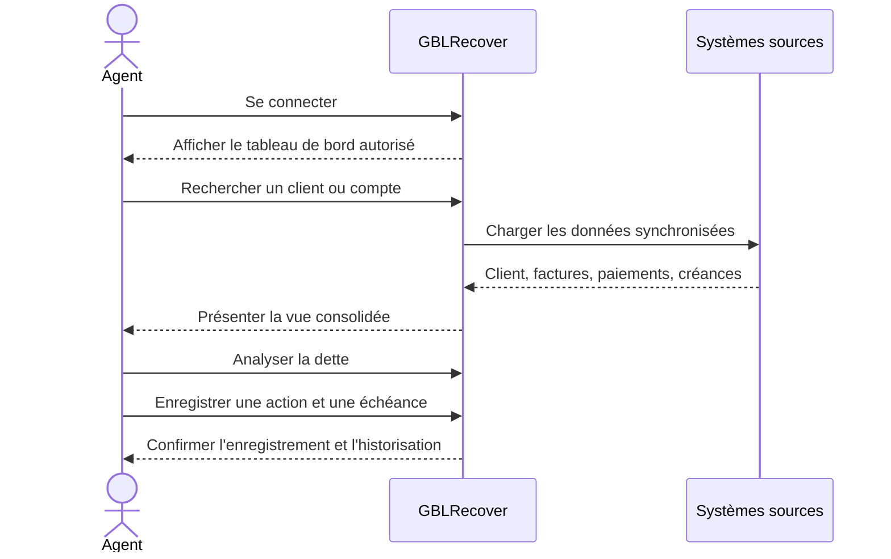

# Product Requirements Document (PRD)

## GBLRecover — Plateforme de Revenue Assurance et de recouvrement

| Élément | Valeur |
|---|---|
| **Client** | CAMTEL |
| **Produit** | GBLRecover |
| **Nature** | Plateforme web métier |
| **Domaine** | Revenue Assurance, facturation, paiements et recouvrement |
| **Version du document** | 1.0 |
| **Statut** | Version finale de cadrage produit |
| **Auteur** | Danielbeni-tech — Senior Product Management |
| **Date** | 7 août 2026 |

> **Note de cadrage.** Ce document formalise les besoins fonctionnels et produit à partir du contexte fourni. Les règles de gestion, seuils de recouvrement, interfaces avec les systèmes existants et indicateurs chiffrés devront être validés avec les équipes métier et techniques de CAMTEL avant lancement du développement.

---

## 1. Présentation du projet

GBLRecover est une plateforme web destinée au service **Revenue Assurance de CAMTEL**. Elle a pour vocation de centraliser, fiabiliser et rendre exploitable l’ensemble des informations nécessaires au suivi du revenu, de la dette client et des activités de recouvrement.

Le produit réunira dans un même environnement les données relatives aux clients, comptes, services, gestionnaires, centres de gestion, agences, factures, paiements et créances. Il permettra aux équipes autorisées de disposer d’une vision consolidée de la situation financière de chaque client, de prioriser les actions de recouvrement et de piloter la performance au niveau opérationnel et managérial.

| Dimension | Description cible |
|---|---|
| **Périmètre métier** | Revenue Assurance, comptes clients, facturation, encaissement et recouvrement |
| **Utilisateurs principaux** | Agents de recouvrement, responsables de centres, managers Revenue Assurance, administrateurs |
| **Valeur attendue** | Réduire les délais de traitement, améliorer la visibilité sur la dette et sécuriser les revenus |
| **Canal** | Application web sécurisée, accessible selon les habilitations |
| **Données principales** | Clients, comptes, services, factures, paiements, créances, affectations organisationnelles |

### 1.1 Résumé exécutif

GBLRecover doit devenir le référentiel opérationnel du recouvrement pour CAMTEL. Le produit ne se limite pas à afficher des données : il doit transformer les informations dispersées en décisions actionnables. Chaque utilisateur doit pouvoir répondre rapidement à quatre questions : **qui doit quoi, depuis quand, pourquoi, et quelle action doit être menée ensuite ?**

### 1.2 Périmètre initial

Le périmètre initial couvre la consultation et la consolidation des données clients et financières, la recherche multicritère, le suivi des créances, la gestion des actions de recouvrement, les tableaux de bord essentiels et la traçabilité des opérations. Les mécanismes avancés d’automatisation, de prédiction et de communication omnicanale sont positionnés en V2.

---

## 2. Vision Produit

> **Faire de GBLRecover la source de vérité opérationnelle de CAMTEL pour piloter la dette, accélérer le recouvrement et protéger durablement le revenu.**

La vision repose sur trois principes. Premièrement, **une donnée unifiée** : les utilisateurs accèdent à une information cohérente, contextualisée et à jour. Deuxièmement, **une action priorisée** : la plateforme aide les équipes à concentrer leurs efforts sur les dossiers présentant le plus fort enjeu ou le plus grand risque. Troisièmement, **un pilotage mesurable** : chaque action, résultat et évolution de la dette doit pouvoir être suivi et analysé.

### 2.1 Principes directeurs

| Principe | Traduction produit |
|---|---|
| **Une vue client à 360°** | Présenter identité, comptes, services, factures, paiements, créances et historique dans un même dossier |
| **La décision par la donnée** | Mettre en évidence les montants, anciennetés, tendances et priorités |
| **L’action au centre** | Associer chaque créance à une action, un responsable, une échéance et un statut |
| **La sécurité par conception** | Appliquer des habilitations selon les rôles, centres et périmètres autorisés |
| **La traçabilité de bout en bout** | Conserver l’historique des modifications et opérations sensibles |
| **La simplicité opérationnelle** | Réduire le nombre d’écrans, ressaisies et manipulations nécessaires |

---

## 3. Contexte métier

Le service Revenue Assurance intervient dans un environnement où la qualité des données commerciales et financières conditionne directement la capacité de CAMTEL à facturer, encaisser et recouvrer. Les informations utiles au suivi de la dette peuvent être réparties entre plusieurs systèmes, structures organisationnelles ou formats de reporting.

Cette dispersion rend plus complexe la constitution d’une vision fiable d’un client. Elle peut entraîner des recherches longues, des écarts entre rapports, une priorisation manuelle des dossiers et une difficulté à mesurer la performance réelle des actions engagées.

GBLRecover s’inscrit donc comme une **couche de consolidation et d’exploitation métier**. Il devra s’intégrer au paysage applicatif existant de CAMTEL sans devenir nécessairement le système producteur de toutes les données sources. La responsabilité de chaque donnée, sa fréquence de mise à jour et son niveau de qualité devront être définis dans le cadre du projet.

### 3.1 Chaîne métier cible

### 3.2 Entités métier principales

| Entité | Rôle dans GBLRecover |
|---|---|
| **Client** | Personne physique ou morale à laquelle sont rattachés des comptes et services |
| **Compte** | Unité de gestion financière ou contractuelle rattachée à un client |
| **Service** | Offre ou prestation consommée par le client |
| **Facture** | Document de facturation associé à un compte ou à un service |
| **Paiement** | Encaissement imputé totalement ou partiellement à une dette |
| **Créance** | Montant dû et non réglé à une date donnée |
| **Gestionnaire** | Collaborateur responsable du suivi d’un périmètre ou d’un dossier |
| **Centre de gestion** | Structure organisationnelle de rattachement et de pilotage |
| **Agence** | Point organisationnel ou commercial associé au client ou au suivi |

---

## 4. Problématique

Les équipes de recouvrement ont besoin d’une information complète et exploitable pour traiter les impayés. En l’absence d’une plateforme centralisée, plusieurs difficultés peuvent apparaître : identification incomplète des débiteurs, rapprochement manuel entre factures et paiements, manque de visibilité sur l’ancienneté de la dette, suivi hétérogène des actions et reporting consommateur de temps.

Le problème produit peut être formulé ainsi :

> **Les équipes CAMTEL ne disposent pas toujours d’un espace unique, fiable et orienté action pour comprendre la situation d’un client, suivre ses créances et mesurer l’efficacité du recouvrement.**

### 4.1 Conséquences métier

| Problème | Conséquence potentielle |
|---|---|
| Données dispersées | Temps élevé consacré à la recherche et au rapprochement |
| Informations non homogènes | Risque d’erreurs dans l’analyse du solde ou de la dette |
| Priorisation manuelle | Effort de recouvrement non toujours aligné sur l’enjeu financier |
| Historique incomplet | Difficulté à comprendre les actions déjà réalisées |
| Reporting manuel | Délais de production et faible réactivité managériale |
| Habilitations peu explicites | Risque d’exposition de données hors périmètre |

---

## 5. Objectifs Business

| Objectif | Résultat attendu |
|---|---|
| **Améliorer le recouvrement** | Augmenter la capacité des équipes à traiter rapidement les créances prioritaires |
| **Réduire le délai d’accès à l’information** | Diminuer le temps nécessaire pour reconstituer la situation d’un client |
| **Sécuriser le revenu** | Réduire les écarts, oublis et pertes liés à une mauvaise visibilité sur la dette |
| **Fiabiliser le pilotage** | Disposer de chiffres communs et traçables pour les managers |
| **Renforcer la responsabilisation** | Relier chaque dossier à un gestionnaire, une structure et un état d’avancement |
| **Préparer l’automatisation** | Constituer une base de données et de processus exploitable par de futures fonctions avancées |

Les objectifs financiers définitifs, notamment les montants de recouvrement additionnels ou les réductions de pertes, devront être fixés après établissement d’une situation de référence mesurée avant le déploiement.

---

## 6. Objectifs Produit

Le produit devra permettre aux utilisateurs de rechercher un client ou un compte en quelques secondes, de visualiser sa situation consolidée, de comprendre la composition de sa dette, d’enregistrer les actions de recouvrement et de suivre les échéances associées.

| Objectif produit | Indicateur de vérification |
|---|---|
| Centraliser la vue client | Un dossier client présente les principales entités liées sans navigation dispersée |
| Rendre la dette lisible | Le montant total, l’ancienneté et le détail des créances sont visibles |
| Faciliter la priorisation | Les dossiers peuvent être filtrés et triés selon des critères métier |
| Structurer le suivi | Toute action possède un statut, une date et un responsable |
| Accélérer le reporting | Les tableaux de bord de base sont disponibles sans retraitement manuel systématique |
| Garantir la traçabilité | Les opérations importantes sont historisées avec utilisateur et horodatage |

---

## 7. Parties prenantes

| Partie prenante | Responsabilité / intérêt | Niveau d’influence |
|---|---|---:|
| Direction CAMTEL | Valide l’orientation et les bénéfices attendus | Élevé |
| Direction Revenue Assurance | Porte la vision métier et arbitre les priorités | Très élevé |
| Équipe recouvrement | Utilise quotidiennement la solution et fournit les besoins opérationnels | Élevé |
| Responsables de centres de gestion | Pilotent les portefeuilles et la performance locale | Élevé |
| Agences | Contribuent à la connaissance et au suivi des clients | Moyen |
| Finance / Comptabilité | Utilise les informations de factures, paiements et soldes | Élevé |
| Direction des systèmes d’information | Garantit architecture, intégration, exploitation et sécurité | Très élevé |
| Sécurité et conformité | Contrôle accès, confidentialité, audit et conservation | Élevé |
| Gestionnaires de comptes | Assurent le traitement des dossiers affectés | Moyen à élevé |
| Direction générale | Suit les indicateurs consolidés et les résultats | Élevé |

### 7.1 Gouvernance de décision

Le Product Owner métier de GBLRecover porte le backlog et la priorisation. La Direction Revenue Assurance valide les règles métier. La DSI valide les choix d’architecture, d’intégration, de sécurité et d’exploitation. Les décisions ayant un impact transverse ou budgétaire sont soumises au comité de pilotage.

---

## 8. Personas détaillés

### Persona A — Agent de recouvrement

L’agent traite un portefeuille de clients et doit comprendre rapidement la situation de chaque dossier. Il recherche les informations, analyse la dette, consigne les interactions et planifie la prochaine action. Sa priorité est la productivité, la fiabilité des données et la simplicité du parcours.

### Persona B — Responsable de centre de gestion

Le responsable supervise une équipe et un portefeuille géographique ou organisationnel. Il doit identifier les dossiers en retard, répartir la charge, suivre les résultats et intervenir sur les cas sensibles. Sa priorité est la visibilité consolidée et la capacité à agir sur les écarts.

### Persona C — Manager Revenue Assurance

Le manager pilote la dette à une échelle transverse. Il compare les performances, suit les tendances, identifie les anomalies et prépare les arbitrages. Sa priorité est la qualité du reporting et la lecture stratégique des indicateurs.

### Persona D — Administrateur fonctionnel

L’administrateur configure les référentiels, les rôles, les périmètres et certains paramètres de fonctionnement. Il veille à la cohérence des données de référence et à la bonne application des habilitations.

### Persona E — Analyste Finance / Comptabilité

L’analyste exploite les données financières pour rapprocher les factures, paiements, soldes et créances. Il recherche une information cohérente, traçable et exportable pour ses analyses et contrôles.

| Persona | Besoin principal | Fréquence d’utilisation | Critère de valeur |
|---|---|---:|---|
| Agent de recouvrement | Traiter efficacement un dossier | Quotidienne | Temps de traitement réduit |
| Responsable de centre | Piloter une équipe et un portefeuille | Quotidienne | Meilleure maîtrise des retards |
| Manager Revenue Assurance | Décider à partir d’une vue consolidée | Hebdomadaire à quotidienne | Reporting fiable et actionnable |
| Administrateur fonctionnel | Maintenir règles et référentiels | Ponctuelle et récurrente | Moins d’erreurs de paramétrage |
| Analyste Finance | Contrôler et analyser les données | Hebdomadaire | Rapprochements facilités |

---

## 9. User Stories

Les user stories ci-dessous constituent la base initiale du backlog. Elles devront être affinées en ateliers et complétées par des critères d’acceptation détaillés.

| ID | En tant que… | Je veux… | Afin de… | Priorité |
|---|---|---|---|---|
| US-01 | Agent | rechercher un client par plusieurs critères | retrouver rapidement le bon dossier | Must |
| US-02 | Agent | consulter la fiche consolidée d’un client | comprendre sa situation globale | Must |
| US-03 | Agent | voir les comptes et services rattachés | relier la dette à son origine | Must |
| US-04 | Agent | consulter les factures impayées | identifier les éléments constitutifs de la dette | Must |
| US-05 | Agent | visualiser les paiements et imputations | vérifier le solde réel | Must |
| US-06 | Agent | enregistrer une action de recouvrement | conserver l’historique du dossier | Must |
| US-07 | Agent | planifier une prochaine action | ne pas perdre le suivi d’une promesse ou relance | Must |
| US-08 | Responsable | filtrer les dossiers de mon périmètre | prioriser le travail de l’équipe | Must |
| US-09 | Responsable | affecter ou réaffecter un dossier | équilibrer la charge et clarifier la responsabilité | Must |
| US-10 | Responsable | consulter les indicateurs du centre | piloter la performance | Must |
| US-11 | Manager | comparer les créances par centre ou agence | identifier les zones de risque | Should |
| US-12 | Analyste Finance | exporter une liste contrôlée | réaliser une analyse complémentaire | Should |
| US-13 | Administrateur | gérer les utilisateurs et rôles | sécuriser l’accès au système | Must |
| US-14 | Administrateur | gérer les référentiels organisationnels | maintenir les rattachements à jour | Must |
| US-15 | Utilisateur autorisé | consulter l’historique des modifications | auditer une donnée ou une action | Must |

### 9.1 Critères d’acceptation transverses

Une fonctionnalité est considérée comme acceptable si elle respecte les habilitations du profil connecté, affiche un état explicite en cas de donnée absente ou obsolète, conserve l’identité et la date des actions sensibles et ne crée pas de doublon lors d’une nouvelle synchronisation.

---

## 10. MVP

Le MVP doit fournir une première valeur opérationnelle complète sur le cycle **consultation — analyse — action — pilotage**. Il doit éviter de reproduire tous les processus existants et se concentrer sur les fonctionnalités indispensables à la maîtrise de la dette.

### 10.1 Périmètre fonctionnel du MVP

| Domaine | Fonctionnalités incluses |
|---|---|
| Authentification | Connexion sécurisée, gestion de session et déconnexion |
| Habilitations | Rôles, périmètres par centre/agence et contrôle d’accès |
| Recherche | Recherche par identifiant client, compte, numéro de facture, téléphone ou autre critère validé |
| Fiche client | Identité, contacts, comptes, services, agence, centre et gestionnaire |
| Facturation | Liste des factures, statuts, montants, dates d’émission et d’échéance |
| Paiements | Historique des paiements, montants et rattachements disponibles |
| Créances | Solde dû, ancienneté, statut, détail par facture et priorisation simple |
| Recouvrement | Actions, commentaires, dates, responsables, échéances et statuts |
| Portefeuille | Liste des dossiers affectés et filtres de suivi |
| Tableaux de bord | Vue synthétique de la dette et de l’activité de recouvrement |
| Référentiels | Gestion des centres, agences, gestionnaires et statuts métier |
| Audit | Journal des opérations sensibles et modifications importantes |
| Export | Export contrôlé de listes et indicateurs autorisés |

### 10.2 Hors périmètre MVP

Le MVP n’inclut pas, sauf décision contraire en comité, la relance automatique multicanale, le scoring prédictif, le paiement en ligne, la négociation automatisée d’échéanciers, les assistants conversationnels, les applications mobiles natives et les remises en état complexes de données historiques.

### 10.3 Parcours cible de l’agent

---

## 11. Fonctionnalités V2

La V2 devra approfondir l’automatisation et l’intelligence de pilotage, après stabilisation des données et adoption du MVP.

| Domaine V2 | Fonctionnalité envisagée | Valeur attendue |
|---|---|---|
| Automatisation | Scénarios de relance selon statut, ancienneté ou montant | Réduire les tâches répétitives |
| Omnicanal | Notifications e-mail, SMS ou autres canaux validés | Améliorer la couverture des relances |
| Scoring | Score de risque ou de probabilité de recouvrement | Prioriser plus finement les dossiers |
| Promesses | Suivi des promesses de paiement et alertes d’échéance | Réduire les ruptures de suivi |
| Échéanciers | Gestion de plans de paiement soumis aux règles CAMTEL | Encadrer les accords de règlement |
| Anomalies | Détection d’écarts entre facturation, paiement et créance | Renforcer la Revenue Assurance |
| Prévisions | Projection de la dette et des encaissements | Améliorer le pilotage prévisionnel |
| Intégrations | Synchronisation plus fréquente et APIs avec les systèmes sources | Réduire les délais de mise à jour |
| Mobilité | Expérience adaptée aux agents en déplacement | Étendre l’usage terrain |
| BI avancée | Analyses multidimensionnelles et rapports paramétrables | Approfondir les décisions managériales |

La priorisation V2 devra être fondée sur les résultats du MVP, les irritants observés, la qualité des données disponible et la capacité d’intégration des systèmes concernés.

---

## 12. KPI métier

Les KPI doivent être définis avec une formule, une source, une fréquence et un responsable. Ils doivent être interprétés conjointement : une hausse des encaissements ne suffit pas à conclure à une amélioration si elle s’accompagne d’un accroissement plus rapide de la dette nouvelle.

| KPI | Définition | Fréquence cible | Niveau |
|---|---|---:|---|
| **Encours total de créances** | Somme des montants restant dus sur le périmètre | Quotidienne | Direction / management |
| **Créances échues** | Montant des créances dont l’échéance est dépassée | Quotidienne | Management |
| **Taux de recouvrement** | Montants recouvrés rapportés aux montants exigibles sur une période | Mensuelle | Direction |
| **DSO / délai moyen d’encaissement** | Délai moyen entre facturation et encaissement, selon définition Finance validée | Mensuelle | Direction / Finance |
| **Âge moyen de la dette** | Moyenne pondérée de l’ancienneté des créances | Hebdomadaire | Management |
| **Part des créances anciennes** | Part de l’encours au-delà d’un seuil d’ancienneté validé | Hebdomadaire | Management |
| **Taux de contact** | Dossiers pour lesquels une action de contact est enregistrée / dossiers à traiter | Quotidienne | Opérationnel |
| **Taux de promesses tenues** | Promesses réglées dans le délai / promesses arrivées à échéance | Mensuelle | Opérationnel |
| **Délai de première action** | Temps entre l’entrée dans le portefeuille et la première action | Quotidienne | Opérationnel |
| **Productivité par gestionnaire** | Dossiers traités ou actions qualifiées par gestionnaire sur une période | Hebdomadaire | Centre |
| **Taux de couverture des données** | Dossiers disposant des attributs obligatoires | Quotidienne | Produit / DSI |
| **Taux d’erreur de rapprochement** | Enregistrements nécessitant une correction / enregistrements contrôlés | Mensuelle | Finance / DSI |

---

## 13. Critères de succès

Le succès de GBLRecover se mesure à la fois par l’adoption, la qualité du service et l’impact métier. Les seuils cibles seront contractualisés après la phase de diagnostic et la mesure de référence.

| Catégorie | Critère de succès |
|---|---|
| Adoption | Les utilisateurs cibles utilisent la plateforme comme outil principal de suivi du portefeuille |
| Utilisabilité | Un agent peut retrouver un dossier et identifier sa dette sans assistance systématique |
| Qualité | Les données critiques sont complètes, cohérentes et datées |
| Performance | Les écrans opérationnels respectent les objectifs de temps de réponse définis par la DSI |
| Traçabilité | Les actions sensibles sont historisées et consultables par les profils autorisés |
| Pilotage | Les responsables disposent d’indicateurs communs sans retraitement manuel récurrent |
| Métier | Le délai de traitement et la capacité de suivi progressent par rapport à la situation de référence |
| Exploitabilité | Le produit dispose de mécanismes de supervision, journalisation et reprise documentés |

### 13.1 Définition de “Done” produit

Une fonctionnalité est livrée lorsqu’elle est développée, testée, documentée, sécurisée selon son niveau de criticité, validée par le métier, instrumentée pour le suivi et intégrée au support opérationnel. Elle doit également disposer d’un comportement explicite pour les données manquantes, les erreurs d’intégration et les accès non autorisés.

---

## 14. Contraintes

| Domaine | Contraintes à prendre en compte |
|---|---|
| Organisation | Coexistence avec les processus et structures actuels de CAMTEL |
| Données | Hétérogénéité, doublons possibles, qualité variable et historique incomplet |
| Intégration | Dépendance aux systèmes producteurs et à leurs interfaces disponibles |
| Sécurité | Confidentialité des données clients, séparation des périmètres et audit des accès |
| Réglementaire | Respect des exigences applicables à la protection et à la conservation des données |
| Technique | Disponibilité, performance, sauvegarde, supervision et continuité de service |
| Adoption | Nécessité de former les équipes et d’accompagner le changement |
| Gouvernance | Validation formelle des règles de gestion et des indicateurs |
| Exploitation | Prévoir support, gestion des incidents et processus de correction des données |

---

## 15. Hypothèses

Le cadrage repose sur les hypothèses suivantes, qui doivent être confirmées pendant la conception détaillée :

1. CAMTEL dispose de sources de données identifiables pour les clients, comptes, services, factures, paiements et structures organisationnelles.
2. Les systèmes sources peuvent fournir des extractions ou interfaces selon une fréquence compatible avec le besoin opérationnel.
3. Les rôles métier, périmètres d’accès et responsabilités de gestion peuvent être définis par CAMTEL.
4. Le service Revenue Assurance nommera des référents métier disponibles pour les ateliers, tests et validations.
5. Les montants et statuts affichés par GBLRecover seront alignés sur des règles de gestion validées par Finance et Revenue Assurance.
6. Le MVP sera déployé progressivement, avec une phase pilote permettant de mesurer la situation de référence.
7. Les données historiques nécessaires au suivi seront disponibles dans une qualité suffisante ou feront l’objet d’un plan de remédiation.

---

## 16. Risques

| Risque | Probabilité | Impact | Mesure de mitigation |
|---|---:|---:|---|
| Données sources incohérentes | Élevée | Très élevé | Profilage, règles de qualité, rapprochements et gouvernance des données |
| Retard d’intégration | Moyenne à élevée | Élevé | Cadrage technique précoce, contrats d’interface et stratégie de repli |
| Règles métier non arbitrées | Moyenne | Élevé | Ateliers de décision, registre des règles et validation par propriétaire métier |
| Faible adoption | Moyenne | Élevé | Co-conception avec les agents, pilote, formation et mesure d’usage |
| Périmètre trop large | Élevée | Élevé | MVP strict, backlog priorisé et gouvernance des changements |
| Accès excessifs | Moyenne | Très élevé | RBAC, moindre privilège, revues périodiques et audit |
| Dépendance à une mise à jour différée | Moyenne | Moyen à élevé | Affichage de la date de fraîcheur et indicateurs de synchronisation |
| Indicateurs contestés | Moyenne | Élevé | Dictionnaire KPI, formules versionnées et validation Finance |
| Performance insuffisante | Moyenne | Élevé | Tests de charge, indexation, pagination et supervision |
| Perte ou altération de données | Faible à moyenne | Très élevé | Sauvegardes, journaux, contrôles d’intégrité et procédures de reprise |

### 16.1 Registre des décisions à prendre

| Décision | Responsable attendu | Échéance de cadrage |
|---|---|---|
| Définition officielle d’une créance et du solde dû | Revenue Assurance + Finance | Avant conception détaillée |
| Fréquence de synchronisation par domaine | DSI + propriétaires des sources | Avant architecture |
| Matrice des rôles et périmètres | Métier + Sécurité | Avant développement des habilitations |
| Liste des identifiants de recherche | Métier + DSI | Avant conception UX |
| Seuils d’ancienneté et de priorité | Revenue Assurance | Avant paramétrage du MVP |
| Périmètre du pilote | Comité de pilotage | Avant recette |

---

## 17. Glossaire métier

| Terme | Définition proposée |
|---|---|
| **Agence** | Entité organisationnelle ou point de présence auquel un client, un compte ou une activité peut être rattaché |
| **Compte** | Unité financière, contractuelle ou de gestion associée à un client |
| **Créance** | Somme exigible restant due par un client ou un compte |
| **Dette** | Ensemble des créances non réglées d’un client, compte ou périmètre |
| **Échéance** | Date à laquelle une facture ou un paiement devient exigible |
| **Facture** | Pièce détaillant les montants facturés pour une période, un service ou une consommation |
| **Gestionnaire** | Personne responsable du suivi d’un compte ou d’un portefeuille |
| **Centre de gestion** | Structure de rattachement utilisée pour organiser et piloter l’activité |
| **Imputation** | Affectation d’un paiement à une ou plusieurs factures ou créances |
| **Impayé** | Montant facturé non réglé à l’échéance ou selon le statut métier retenu |
| **Portefeuille** | Ensemble des dossiers attribués à un gestionnaire, une agence ou un centre |
| **Promesse de paiement** | Engagement d’un client à régler un montant à une date donnée |
| **Recouvrement** | Ensemble des actions visant à obtenir le règlement d’une créance |
| **Revenue Assurance** | Discipline visant notamment à sécuriser la génération, la facturation, l’encaissement et la conservation du revenu |
| **Solde** | Différence entre les montants dus et les montants réglés ou imputés |
| **Service** | Produit, offre ou prestation consommée par un client |
| **Statut** | État métier d’une facture, créance, action ou d’un dossier |
| **Vue client à 360°** | Présentation consolidée des informations utiles à la compréhension et au traitement d’un client |

---

## Validation attendue

Avant lancement de la conception détaillée, le présent PRD doit être relu et validé par la Direction Revenue Assurance, les représentants du recouvrement, la Finance, la DSI et la Sécurité. Toute modification portant sur le périmètre, les règles de calcul, les habilitations ou les KPI devra être inscrite dans un registre de décisions et reflétée dans le backlog produit.

## Conclusion

GBLRecover doit fournir à CAMTEL une base opérationnelle commune pour passer d’un recouvrement principalement fondé sur la recherche et le rapprochement à un recouvrement **consolidé, priorisé et mesurable**. La réussite du produit dépendra autant de la qualité des interfaces et des données que de l’appropriation par les équipes métier.

La recommandation produit est de lancer un MVP centré sur la vue client, la dette, les actions de recouvrement, les habilitations et le pilotage essentiel. Une fois la fiabilité des données et l’usage stabilisés, CAMTEL pourra enrichir la solution avec l’automatisation, le scoring, la détection d’anomalies et les capacités avancées de prévision.

## Références

Ce PRD est un document de cadrage interne élaboré à partir du contexte et des besoins fournis dans la demande. Aucune source externe n’a été utilisée pour établir les exigences spécifiques de GBLRecover ; les définitions, seuils et règles de gestion restent soumis à validation par CAMTEL.
