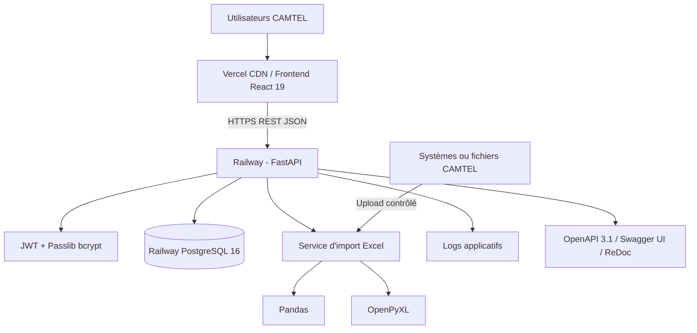
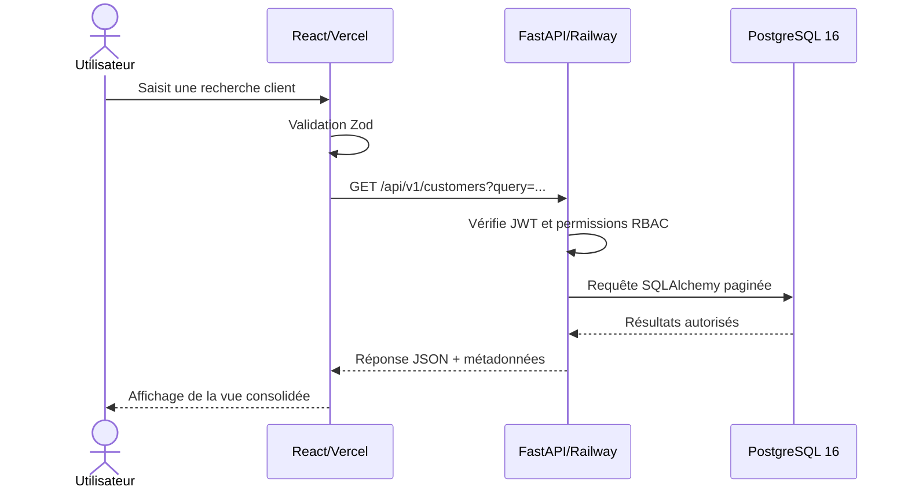
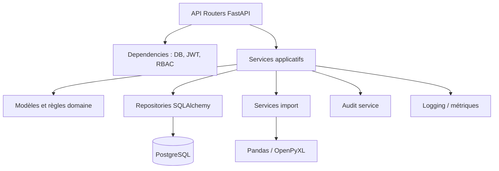
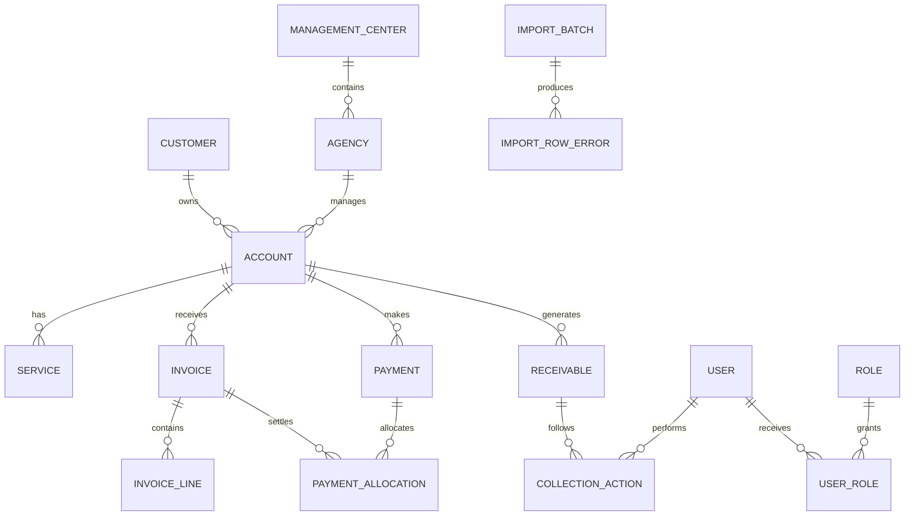
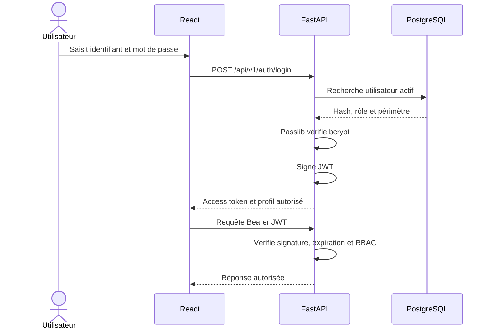
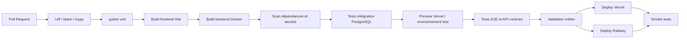
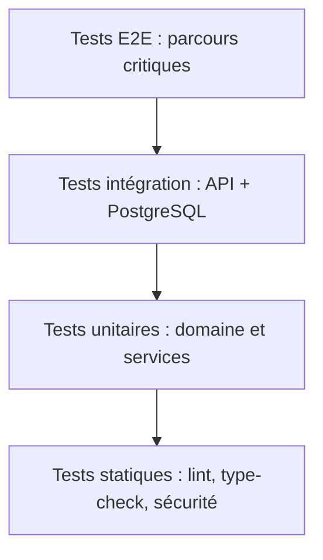

# Technical Requirements Document (TRD) officiel

## GBLRecover — Plateforme décisionnelle de Revenue Assurance et de recouvrement

| Élément | Valeur |
|---|---|
| **Organisation** | CAMTEL |
| **Produit** | GBLRecover |
| **Domaine** | Revenue Assurance, créances, recouvrement et pilotage décisionnel |
| **Type de document** | Technical Requirements Document / Architecture Logicielle d’Entreprise |
| **Version** | 1.0 |
| **Statut** | Document officiel — architecture cible soumise à validation |
| **Auteur** | Principal Software Architect |
| **Date** | 7 août 2026 |

> **Objet.** Ce document définit l’architecture logicielle, les exigences techniques, les standards d’implémentation et les principes d’exploitation de GBLRecover. Il constitue la référence technique pour la conception, le développement, la qualification, le déploiement et l’évolution de la plateforme.

> **Périmètre.** L’application centralise les données relatives aux clients, comptes, services, factures, paiements, créances, gestionnaires, centres de gestion et agences afin de faciliter le recouvrement, maîtriser la dette et fournir une plateforme décisionnelle de suivi des créances.

---

## 1. Architecture globale

### 1.1 Vision cible

GBLRecover adopte une architecture web en trois niveaux, composée d’un frontend React déployé sur Vercel, d’une API REST FastAPI déployée sur Railway et d’une base PostgreSQL 16 hébergée sur Railway. Les traitements d’import Excel sont exécutés côté backend avec Pandas et OpenPyXL, sous la responsabilité de services applicatifs contrôlés.

Le backend est conçu comme un **monolithe modulaire**. Ce choix est volontaire : il permet de préserver la cohérence transactionnelle des données financières, de réduire la complexité opérationnelle et de livrer rapidement un produit fiable. Les frontières de modules sont néanmoins explicites afin de permettre une extraction ultérieure si un domaine acquiert des besoins indépendants d’échelle ou de cycle de vie.

### 1.2 Diagramme d’architecture globale



### 1.3 Responsabilité des composants

| Composant | Technologie imposée | Responsabilité |
|---|---|---|
| Interface utilisateur | React 19, Vite, TypeScript | Recherche, consultation, suivi, tableaux de bord et administration |
| Design system | Tailwind CSS, shadcn/ui | Composants cohérents, accessibles et maintenables |
| État serveur | TanStack Query | Cache, synchronisation, invalidation et gestion des requêtes API |
| Formulaires | React Hook Form, Zod | Saisie performante et validation côté client alignée sur les contrats |
| API | FastAPI, Uvicorn, Python 3.12 | Exposition REST, règles d’accès, orchestration et transactions |
| Validation backend | Pydantic v2 | Validation des entrées, sorties et configurations |
| ORM | SQLAlchemy 2.0 | Accès typé et transactionnel à PostgreSQL |
| Migrations | Alembic | Évolution versionnée du schéma de données |
| Authentification | JWT, Passlib bcrypt | Sessions applicatives et stockage sécurisé des mots de passe |
| Base de données | PostgreSQL 16 | Données transactionnelles, référentiels et créances |
| Import | Pandas, OpenPyXL | Lecture, normalisation, contrôle et chargement des fichiers Excel |
| Frontend hosting | Vercel | Build, CDN et livraison de l’application web |
| Backend hosting | Railway | Exécution du service FastAPI et gestion du déploiement |
| Données hosting | Railway PostgreSQL | Base relationnelle managée et sauvegardes selon offre retenue |

### 1.4 Flux principal



### 1.5 Principes directeurs

| Principe | Exigence d’architecture |
|---|---|
| **Cohérence financière** | Les écritures de créances, paiements et imputations sont transactionnelles |
| **API first** | Les fonctionnalités métier sont exposées par des contrats REST documentés |
| **Validation à chaque frontière** | Les données sont validées dans le navigateur, l’API et la couche domaine |
| **Moindre privilège** | L’accès est accordé par rôle et périmètre organisationnel |
| **Traçabilité** | Les opérations sensibles sont journalisées avec acteur et horodatage |
| **Idempotence** | Les imports et opérations répétables ne créent pas de doublons |
| **Observabilité** | Les erreurs et temps de réponse sont corrélables par identifiant de requête |
| **Évolutivité pragmatique** | Le monolithe modulaire est privilégié avant toute extraction en microservices |

---

## 2. Architecture Frontend

### 2.1 Stack et justification

Le frontend est une Single Page Application développée avec React 19, TypeScript et Vite. React 19 fournit le modèle de composants et les capacités modernes de rendu ; TypeScript réduit les erreurs de contrat ; Vite assure un cycle de développement rapide et un build optimisé.

Tailwind CSS et shadcn/ui constituent la base du design system. Les composants shadcn/ui sont versionnés dans le code du projet afin de permettre leur personnalisation et d’éviter une dépendance opaque à une bibliothèque runtime. TanStack Query est utilisé pour l’état distant ; React Hook Form et Zod structurent les formulaires et la validation.

### 2.2 Architecture par fonctionnalités

```text
src/
├── app/                  # Routage, providers, layout et configuration
├── components/           # Composants transverses et design system
├── features/
│   ├── auth/
│   ├── dashboard/
│   ├── customers/
│   ├── accounts/
│   ├── services/
│   ├── invoices/
│   ├── payments/
│   ├── receivables/
│   ├── collection-actions/
│   ├── portfolios/
│   ├── imports/
│   └── administration/
├── lib/                  # Client HTTP, utilitaires et configuration
├── hooks/                # Hooks partagés
├── schemas/              # Schémas Zod
├── styles/
└── main.tsx
```

Chaque fonctionnalité regroupe ses composants, hooks, schémas, types, fonctions d’accès API et tests. Les composants transverses ne doivent pas contenir de logique métier spécifique à un module.

### 2.3 Gestion de l’état

| Type d’état | Technologie / règle |
|---|---|
| État serveur | TanStack Query avec clés de requête normalisées |
| État de formulaire | React Hook Form |
| Validation | Zod côté frontend, schémas Pydantic côté backend |
| État d’interface local | `useState`, `useReducer` ou store minimal validé |
| État d’authentification | Contexte applicatif alimenté par le mécanisme JWT |
| Cache | Cache TanStack Query avec durée adaptée à la fraîcheur métier |

TanStack Query gère les états de chargement, erreur, rafraîchissement, invalidation après mutation et pagination. Les données de dette et de créances doivent afficher la date de dernière synchronisation lorsqu’elles ne sont pas temps réel.

### 2.4 Règles UX et accessibilité

L’interface doit fournir des états explicites pour le chargement, l’absence de données, l’erreur, l’accès refusé et la donnée obsolète. Les écrans financiers doivent afficher clairement devise, séparateurs, signe, précision et date de référence.

Les formulaires doivent associer chaque erreur à son champ, conserver les valeurs saisies lorsque cela est possible et empêcher les doubles soumissions. Les tableaux volumineux utilisent pagination, filtres et tri côté serveur. La navigation clavier, les contrastes et les libellés accessibles sont obligatoires pour les composants communs.

### 2.5 Client API

Le frontend utilise un client HTTP centralisé qui :

- ajoute les en-têtes d’authentification ;
- génère ou propage un `X-Request-ID` ;
- convertit les erreurs API en objets typés ;
- applique un timeout explicite ;
- évite les retries automatiques sur les mutations financières ;
- déclenche le renouvellement ou la déconnexion si le JWT est expiré ;
- normalise les réponses paginées.

---

## 3. Architecture Backend

### 3.1 FastAPI comme framework exclusif

Le backend est développé exclusivement avec FastAPI sur Python 3.12. Uvicorn sert de serveur ASGI. FastAPI fournit le routage, l’injection de dépendances, la validation basée sur Pydantic v2 et la génération de documentation OpenAPI.

Le backend ne doit pas mélanger la logique métier dans les routeurs. Les endpoints traduisent les requêtes HTTP en cas d’usage ; les services applicatifs orchestrent les opérations ; les modèles de domaine portent les invariants ; les repositories et adaptateurs encapsulent les accès externes.

### 3.2 Architecture en couches



### 3.3 Modules backend

| Module | Responsabilités |
|---|---|
| `auth` | Login, génération JWT, vérification de hash et gestion de session |
| `users` | Utilisateurs, activation, désactivation et profil |
| `rbac` | Rôles, permissions et contrôle de périmètre |
| `customers` | Clients et informations d’identification |
| `accounts` | Comptes et rattachements organisationnels |
| `services` | Services associés aux comptes |
| `invoices` | Factures, échéances, statuts et montants |
| `payments` | Paiements, références et imputations |
| `receivables` | Créances, soldes, ancienneté et statuts |
| `collections` | Actions, commentaires, promesses et affectations |
| `organizations` | Centres, agences et gestionnaires |
| `imports` | Fichiers Excel, lots, rejets et résultats |
| `reporting` | KPI, agrégats et exports contrôlés |
| `audit` | Journal des opérations sensibles |

### 3.4 Transactions et unités de travail

Une unité de travail SQLAlchemy est créée par requête ou par tâche métier. Les endpoints d’écriture utilisent `commit` explicite, suivi d’un `refresh` lorsque la réponse exige les valeurs générées par la base. Toute exception provoque un rollback avant propagation vers le gestionnaire d’erreurs.

Les opérations de paiement, d’imputation et de recalcul de créance doivent être atomiques. Les imports sont traités par lot avec stratégie de rejet documentée : soit le lot complet est transactionnel, soit les lignes valides sont chargées et les lignes invalides sont isolées dans un rapport, selon la règle métier retenue.

### 3.5 Asynchronisme

Les opérations longues — import Excel important, génération d’export, recalcul massif — ne doivent pas bloquer une requête HTTP. Une première implémentation peut utiliser un mécanisme de tâche contrôlée compatible Railway ; l’introduction d’un broker et de workers dédiés est recommandée dès que le volume ou le besoin de reprise le justifie.

---

## 4. Architecture Base de données

### 4.1 PostgreSQL 16

PostgreSQL 16 est la base transactionnelle officielle de GBLRecover. Elle assure l’intégrité référentielle, les transactions ACID, les contraintes d’unicité, les agrégations contrôlées et la compatibilité avec SQLAlchemy 2.0.

La base de données reste la source transactionnelle de GBLRecover pour les données importées et les actions de recouvrement créées dans l’application. La provenance de chaque donnée est conservée par des métadonnées de source et de synchronisation.

### 4.2 Modèle relationnel logique



### 4.3 Tables principales

| Table | Clé et contenu principal |
|---|---|
| `customers` | Identité, type, identifiant externe, contacts et statut |
| `accounts` | Numéro de compte, client, agence, centre et statut |
| `services` | Code service, libellé, compte et état |
| `invoices` | Numéro, compte, dates, montants et statut |
| `invoice_lines` | Détail de facture, service et montants |
| `payments` | Référence, date, montant, compte et statut |
| `payment_allocations` | Imputation paiement-facture et montant imputé |
| `receivables` | Créance, montant initial, solde, ancienneté et statut |
| `collection_actions` | Type, propriétaire, date, résultat et commentaire |
| `users` | Utilisateur, hash éventuel, statut et organisation |
| `roles` / `permissions` | Modèle RBAC |
| `organizations` | Centres, agences et hiérarchie |
| `import_batches` | Fichier, empreinte, statut, volumes et dates |
| `import_row_errors` | Ligne rejetée, colonne, valeur et motif |
| `audit_events` | Acteur, action, entité, horodatage et métadonnées |

### 4.4 Contraintes et types

Les montants sont stockés avec `NUMERIC` et une précision/échelle documentée. Les dates sont stockées en UTC ou selon une politique temporelle validée. Les clés externes des systèmes sources sont conservées et indexées.

Les tables financières ne sont pas supprimées physiquement dans le fonctionnement courant. Les statuts de désactivation, d’annulation ou d’archivage sont préférés. Les colonnes `created_at`, `updated_at`, `created_by`, `updated_by` et, lorsque nécessaire, `source_updated_at` sont standardisées.

### 4.5 SQLAlchemy et Alembic

Les modèles SQLAlchemy utilisent la syntaxe déclarative moderne de SQLAlchemy 2.0 avec annotations Python. Les sessions sont injectées par dépendance FastAPI. Les migrations Alembic sont générées, relues et testées ; une migration ne doit pas être exécutée directement en production sans validation de son plan d’impact.

Les migrations destructives sont séparées des migrations additives. Les changements incompatibles avec une version précédente suivent une stratégie expand-and-contract afin de permettre un déploiement progressif.

---

## 5. Architecture API REST

### 5.1 Contrat

L’API est REST, versionnée sous `/api/v1`, et retourne des documents JSON. FastAPI génère la spécification OpenAPI 3.1 exposée via Swagger UI et ReDoc. Les schémas de requête et de réponse sont définis par Pydantic v2.

| Élément | Standard |
|---|---|
| Base URL | `/api/v1` |
| Format | JSON UTF-8 |
| Authentification | `Authorization: Bearer <JWT>` |
| Corrélation | `X-Request-ID` |
| Pagination | `page`, `page_size` bornés ou curseur selon volumétrie |
| Tri | Liste blanche de champs autorisés |
| Filtrage | Paramètres validés et composables |
| Documentation | OpenAPI 3.1, Swagger UI, ReDoc |

### 5.2 Ressources principales

| Ressource | Endpoints indicatifs |
|---|---|
| Clients | `GET /customers`, `GET /customers/{id}` |
| Comptes | `GET /accounts`, `GET /accounts/{id}` |
| Services | `GET /services`, `GET /accounts/{id}/services` |
| Factures | `GET /invoices`, `GET /invoices/{id}` |
| Paiements | `GET /payments`, `GET /payments/{id}` |
| Créances | `GET /receivables`, `GET /receivables/{id}` |
| Actions | `POST /collection-actions`, `PATCH /collection-actions/{id}` |
| Tableaux de bord | `GET /dashboards/summary`, `GET /dashboards/aging` |
| Imports | `POST /imports`, `GET /imports/{id}`, `GET /imports/{id}/errors` |
| Administration | `GET/POST/PATCH /users`, `/roles`, `/organizations` |
| Audit | `GET /audit-events` |

### 5.3 Réponse standard

```json
{
  "data": {},
  "meta": {
    "request_id": "01J...",
    "page": 1,
    "page_size": 25,
    "total": 120
  }
}
```

Réponse d’erreur :

```json
{
  "error": {
    "code": "VALIDATION_ERROR",
    "message": "La requête contient des données invalides.",
    "details": [
      {"field": "due_date", "reason": "must_be_after_issue_date"}
    ],
    "request_id": "01J..."
  }
}
```

### 5.4 Bonnes pratiques REST

Les endpoints de lecture sont idempotents. Les mutations financières utilisent une clé d’idempotence. Les ressources sont nommées au pluriel. Les codes HTTP sont cohérents : `200` pour lecture réussie, `201` pour création, `202` pour traitement asynchrone, `204` pour suppression logique réussie, `400` pour requête invalide, `401` pour authentification absente ou invalide, `403` pour accès refusé, `404` pour ressource absente, `409` pour conflit, `422` pour erreur de validation et `500/503` pour défauts techniques.

### 5.5 Documentation

Swagger UI est utilisé pour l’exploration interactive en développement et en environnement interne contrôlé. ReDoc fournit une présentation lisible du contrat. En production, l’exposition publique de la documentation est désactivée ou protégée par authentification selon la politique CAMTEL.

---

## 6. Architecture Sécurité

### 6.1 Défense en profondeur

La sécurité est appliquée sur les couches réseau, hébergement, API, données, identité, code et exploitation. L’API ne fait jamais confiance à une décision d’autorisation prise uniquement par le frontend.

| Couche | Contrôles |
|---|---|
| Transport | HTTPS, certificats gérés et interdiction des flux sensibles en clair |
| API | Validation Pydantic, rate limiting, CORS restrictif et headers sécurisés |
| Identité | JWT signés, expiration, révocation contrôlée et bcrypt |
| Autorisation | RBAC et filtrage par centre/agence/portefeuille |
| Données | Secrets externalisés, sauvegardes protégées et accès DB limité |
| Code | Revue, SAST, analyse des dépendances et secrets scanning |
| Audit | Journal des actions sensibles et changements d’habilitation |
| Hébergement | Variables sécurisées Railway/Vercel et environnements séparés |

### 6.2 Gestion des secrets

Les clés JWT, URL de base, identifiants PostgreSQL et paramètres sensibles sont injectés par variables d’environnement ou gestionnaire de secrets. Ils ne sont jamais committés, écrits dans un fichier exemple réel ou imprimés dans les logs. Les secrets de production sont distincts de ceux de préproduction.

### 6.3 Protection des données

Les environnements de développement et de test utilisent des données synthétiques ou anonymisées. Les exports sont limités selon le rôle et doivent être associés à une durée de vie. Les fichiers Excel déposés doivent être contrôlés avant traitement et stockés temporairement uniquement si nécessaire.

---

## 7. Authentification et Autorisation (RBAC)

### 7.1 Authentification JWT

Le mécanisme JWT est utilisé pour authentifier les requêtes API. Après vérification des identifiants, le backend émet un access token signé, de durée de vie courte. Un refresh token peut être ajouté si le parcours utilisateur l’exige ; sa stratégie de stockage, rotation et révocation doit être validée avant production.

Le mot de passe n’est jamais stocké en clair. Passlib avec bcrypt est utilisé pour le hash et la vérification. Le coût bcrypt doit être configuré selon les capacités de Railway et vérifié par test de charge. Les messages d’échec de login ne doivent pas révéler si l’utilisateur existe.

### 7.2 Flux d’authentification



### 7.3 RBAC et périmètre

L’autorisation combine rôle et périmètre. Un agent peut accéder aux dossiers de son portefeuille ; un responsable peut accéder à son centre ; un manager peut accéder à un périmètre transverse ; un administrateur est limité aux capacités d’administration qui lui sont attribuées.

| Rôle | Accès principal |
|---|---|
| `agent` | Lecture et actions sur son portefeuille |
| `center_manager` | Portefeuille et KPI de son centre |
| `revenue_assurance_manager` | Pilotage transverse autorisé |
| `finance_analyst` | Lecture financière et exports autorisés |
| `functional_admin` | Référentiels fonctionnels |
| `security_admin` | Utilisateurs, rôles et audit des accès |
| `auditor` | Lecture contrôlée de l’audit |

Les permissions suivent une convention telle que `receivables:read`, `collection_actions:create`, `imports:execute` ou `users:manage`. Les contrôles sont appliqués dans des dépendances FastAPI réutilisables et renforcés par des filtres SQL côté service.

---

## 8. Gestion des erreurs

### 8.1 Hiérarchie d’erreurs

Les erreurs de domaine sont distinctes des erreurs HTTP et des exceptions d’infrastructure. Le backend définit des exceptions métier structurées, converties par des exception handlers FastAPI en réponses homogènes.

| Type | Code HTTP | Exemple |
|---|---:|---|
| Requête invalide | 400 | Paramètre incohérent |
| Non authentifié | 401 | JWT absent, invalide ou expiré |
| Non autorisé | 403 | Portefeuille hors périmètre |
| Introuvable | 404 | Créance inexistante |
| Conflit | 409 | Doublon ou modification concurrente |
| Validation | 422 | Schéma Pydantic invalide |
| Limitation | 429 | Trop de requêtes |
| Dépendance indisponible | 503 | Base temporairement inaccessible |
| Erreur interne | 500 | Défaut inattendu corrélé par request ID |

### 8.2 Règles

Les messages retournés au client sont utiles mais ne révèlent ni stack trace, ni requête SQL, ni secret. Les erreurs inattendues sont loguées avec stack trace côté serveur et associées à un identifiant de corrélation. Les retries ne sont appliqués automatiquement qu’aux opérations sûres et idempotentes.

---

## 9. Gestion des logs

Les logs sont structurés en JSON et centralisés par la plateforme d’hébergement ou le système d’observabilité retenu. Chaque événement comporte au minimum `timestamp`, `level`, `service`, `environment`, `version`, `request_id`, `user_id` pseudonymisé si nécessaire, `event_code` et `duration_ms`.

| Niveau | Usage |
|---|---|
| `DEBUG` | Diagnostic local non activé en production par défaut |
| `INFO` | Événement normal : requête terminée, import démarré |
| `WARNING` | Situation anormale récupérable : rejet de ligne, retry |
| `ERROR` | Échec nécessitant investigation |
| `CRITICAL` | Défaillance majeure ou risque de disponibilité |

Les logs ne doivent contenir ni mot de passe, ni token complet, ni secret, ni donnée financière inutile, ni contenu intégral de fichier Excel. Les opérations sensibles disposent en plus d’un `audit_event` persistant, distinct du log technique.

---

## 10. Validation des données

### 10.1 Validation multi-niveaux

| Niveau | Technologie / responsabilité |
|---|---|
| Interface | Zod, messages immédiats et prévention de saisies invalides |
| Transport API | Pydantic v2, types stricts et contraintes de schéma |
| Application | Règles métier : dates, montants, statuts et transitions |
| Base | Clés étrangères, unicité, `NOT NULL`, `CHECK` et contraintes transactionnelles |
| Import | Contrôle de colonnes, types, doublons, références et cohérence de lot |

La validation frontend améliore l’expérience mais ne remplace jamais la validation backend. Les modèles Pydantic d’entrée et de sortie sont distincts lorsque la représentation publique diffère du modèle de persistance.

### 10.2 Règles métier indicatives

Les dates d’échéance ne peuvent pas être incohérentes avec la date d’émission. Les montants doivent être positifs lorsque le type d’opération l’exige. Une allocation de paiement ne peut pas dépasser le montant disponible. Une action de recouvrement doit être associée à une créance autorisée et à un utilisateur habilité.

---

## 11. Pipeline d’import Excel

### 11.1 Objectif

Le pipeline permet d’importer des fichiers Excel contenant des données clients, comptes, factures, paiements ou créances. Pandas est utilisé pour la manipulation tabulaire et OpenPyXL pour la lecture des classeurs `.xlsx`, les feuilles, les cellules et les métadonnées utiles.

### 11.2 Architecture du pipeline


### 11.3 Étapes détaillées

| Étape | Contrôles |
|---|---|
| Réception | Extension autorisée, taille maximale, nom, checksum et utilisateur |
| Lecture | Feuille attendue, fichier non corrompu, nombre de lignes borné |
| Mapping | Correspondance colonnes source / colonnes canoniques |
| Normalisation | Dates, montants, espaces, accents, identifiants et valeurs nulles |
| Validation | Types, champs obligatoires, domaines de valeurs et références |
| Déduplication | Clé métier, identifiant source et détection intra-fichier |
| Chargement | Upsert ou insertion selon stratégie approuvée |
| Rejets | Ligne, colonne, valeur masquée si sensible et motif précis |
| Finalisation | Volumes, durée, statut, audit et rapport téléchargeable |

### 11.4 Idempotence et traçabilité

Chaque import reçoit un `batch_id`, un checksum du fichier, une origine, un utilisateur, une date et un statut. Le même fichier ne doit pas être chargé deux fois sans confirmation explicite. Les clés externes et le numéro de lot permettent de rejouer un import de manière contrôlée.

Les gros fichiers ne sont pas chargés entièrement en mémoire sans limite. Le pipeline doit définir une taille maximale, utiliser des traitements par chunks lorsque possible et déplacer les imports volumineux vers une tâche asynchrone.

### 11.5 Sécurité de l’import

Les fichiers sont stockés temporairement dans un espace isolé, analysés selon les contrôles disponibles et supprimés conformément à la politique de rétention. Les macros et formules ne sont pas exécutées. Les contenus ne sont pas rendus directement dans l’interface sans échappement.

---

## 12. Gestion des performances

### 12.1 Objectifs indicatifs

Les objectifs suivants constituent une base de qualification ; ils doivent être validés avec CAMTEL sur des volumes représentatifs.

| Scénario | Objectif P95 indicatif |
|---|---:|
| Recherche client paginée | < 2 secondes |
| Consultation fiche client | < 3 secondes |
| Consultation créance | < 2 secondes |
| Création action de recouvrement | < 2 secondes |
| Endpoint API de lecture simple | < 500 ms |
| Endpoint API d’écriture simple | < 800 ms |
| Import massif | Asynchrone avec progression et résultat |

### 12.2 Techniques

La pagination est obligatoire sur les listes. Les requêtes SQLAlchemy évitent le N+1 grâce à des stratégies de chargement explicites. Les colonnes de recherche courante sont indexées après analyse des plans SQL. Les agrégats de dashboard peuvent être pré-calculés ou matérialisés si leur recalcul en temps réel est trop coûteux.

Le backend FastAPI est exécuté avec plusieurs workers Uvicorn selon les ressources Railway disponibles. Le nombre de workers doit être mesuré, et non augmenté automatiquement sans test, afin d’éviter la saturation de la base.

---

## 13. CI/CD

### 13.1 Pipeline cible



### 13.2 Contrôles obligatoires

Chaque pull request doit exécuter formatage, lint, typage, tests unitaires, tests d’intégration, build et analyse de sécurité. Les migrations Alembic sont testées sur une base PostgreSQL 16 éphémère ou dédiée. Les images Docker sont construites de manière reproductible et identifiées par commit.

Le frontend est déployé sur Vercel après validation du build. Le backend et les migrations sont déployés sur Railway selon une promotion contrôlée. Les variables d’environnement sont propres à chaque environnement.

---

## 14. Docker et Docker Compose

### 14.1 Dockerfile backend recommandé

Le backend utilise une image Python 3.12 légère, un environnement virtuel ou gestionnaire de dépendances reproductible, un utilisateur non root et une commande Uvicorn explicite. L’image ne contient ni secret, ni données d’import, ni artefact de test inutile.

```dockerfile
FROM python:3.12-slim

ENV PYTHONDONTWRITEBYTECODE=1 \
    PYTHONUNBUFFERED=1

WORKDIR /app

RUN useradd --create-home appuser
COPY requirements.txt .
RUN pip install --no-cache-dir -r requirements.txt

COPY app ./app
COPY alembic.ini .
COPY alembic ./alembic

USER appuser
EXPOSE 8000
CMD ["uvicorn", "app.main:app", "--host", "0.0.0.0", "--port", "8000"]
```

Le Dockerfile réel doit être durci, verrouiller les versions, inclure un healthcheck adapté et utiliser un processus de migration séparé du démarrage applicatif lorsque la politique d’exploitation l’exige.

### 14.2 Docker Compose local

```yaml
services:
  api:
    build: .
    ports:
      - "8000:8000"
    environment:
      DATABASE_URL: postgresql+psycopg://gblrecover:gblrecover@db:5432/gblrecover
      JWT_SECRET_KEY: local-only-secret
      APP_ENV: development
    depends_on:
      db:
        condition: service_healthy

  db:
    image: postgres:16
    environment:
      POSTGRES_USER: gblrecover
      POSTGRES_PASSWORD: gblrecover
      POSTGRES_DB: gblrecover
    ports:
      - "5432:5432"
    healthcheck:
      test: ["CMD-SHELL", "pg_isready -U gblrecover -d gblrecover"]
      interval: 5s
      timeout: 5s
      retries: 10
```

Les secrets figurant dans cet exemple sont strictement réservés au développement local. Ils ne doivent jamais être réutilisés dans Railway, Vercel ou un environnement partagé.

---

## 15. Arborescence du projet

```text
gblrecover/
├── frontend/
│   ├── src/
│   │   ├── app/
│   │   ├── components/
│   │   ├── features/
│   │   ├── hooks/
│   │   ├── lib/
│   │   ├── schemas/
│   │   ├── types/
│   │   └── main.tsx
│   ├── public/
│   ├── index.html
│   ├── package.json
│   ├── vite.config.ts
│   ├── tailwind.config.ts
│   └── tsconfig.json
├── backend/
│   ├── app/
│   │   ├── main.py
│   │   ├── core/
│   │   │   ├── config.py
│   │   │   ├── security.py
│   │   │   ├── logging.py
│   │   │   └── errors.py
│   │   ├── db/
│   │   │   ├── session.py
│   │   │   ├── base.py
│   │   │   └── models/
│   │   ├── api/
│   │   │   ├── deps.py
│   │   │   └── v1/
│   │   │       ├── router.py
│   │   │       └── endpoints/
│   │   ├── schemas/
│   │   ├── models/
│   │   ├── repositories/
│   │   ├── services/
│   │   ├── domains/
│   │   ├── imports/
│   │   └── audit/
│   ├── alembic/
│   ├── alembic.ini
│   ├── requirements.txt
│   ├── Dockerfile
│   └── pyproject.toml
├── tests/
│   ├── frontend/
│   ├── backend/
│   ├── integration/
│   ├── e2e/
│   └── performance/
├── docker-compose.yml
├── .env.example
├── .github/workflows/
├── docs/
│   ├── architecture/
│   ├── adr/
│   ├── api/
│   └── runbooks/
└── README.md
```

---

## 16. Standards de développement

Le développement suit une approche contract-first et test-first pour les règles métier critiques. Les modifications sont soumises par pull request, relues par au moins un mainteneur du module et validées automatiquement par la CI.

Les standards suivants sont obligatoires :

| Domaine | Standard |
|---|---|
| Python | PEP 8, typing, Ruff, Black, mypy selon périmètre validé |
| FastAPI | Routeurs minces, dépendances injectées et schémas Pydantic explicites |
| SQLAlchemy | API 2.0, sessions contrôlées, requêtes explicites et transactions délimitées |
| Migrations | Alembic versionné, revue et test de rollback ou stratégie de compatibilité |
| React | Composants fonctionnels, hooks, séparation UI / accès données |
| TypeScript | Mode strict, types explicites aux frontières et absence de `any` non justifié |
| CSS | Tailwind et composants shadcn/ui ; pas de styles inline dispersés |
| API | REST versionné, OpenAPI, pagination et erreurs standardisées |
| Sécurité | Secrets hors dépôt, logs minimisés et autorisation côté serveur |
| Documentation | README, ADR, contrats API et runbooks maintenus avec le code |

Les dépendances sont verrouillées par versions compatibles et mises à jour régulièrement via une procédure contrôlée. Les changements de dépendance ayant un impact sécurité ou licence sont documentés.

---

## 17. Conventions de nommage

| Élément | Convention |
|---|---|
| Module Python | `snake_case` |
| Fonction / variable Python | `snake_case` |
| Classe Python | `PascalCase` |
| Constante Python | `UPPER_SNAKE_CASE` |
| Composant React | `PascalCase` |
| Hook React | `useCamelCase` |
| Fichier TypeScript | `kebab-case.ts` ou convention de fonctionnalité approuvée |
| Table SQL | `snake_case` au pluriel |
| Colonne SQL | `snake_case` |
| Endpoint REST | Pluriel : `/receivables`, `/collection-actions` |
| Schéma Pydantic | Suffixes `Create`, `Update`, `Read`, `List` |
| Permission | `resource:action` |
| Variable d’environnement | `UPPER_SNAKE_CASE` |
| Migration Alembic | Identifiant généré + description courte |
| Test | `test_<behavior>.py` ou `<feature>.spec.ts` |

Les acronymes sont évités dans les noms métier sauf s’ils sont officiellement reconnus. Les noms doivent décrire l’intention plutôt que l’implémentation.

---

## 18. Stratégie de tests

### 18.1 Pyramide de tests



### 18.2 Niveaux

| Niveau | Outils / cible | Exemples |
|---|---|---|
| Statique | Ruff, Black, mypy, TypeScript, ESLint | Erreurs de style, types et dépendances |
| Unitaire backend | pytest | Règles de dette, transitions et validation |
| Unitaire frontend | Vitest | Composants, hooks et schémas Zod |
| Intégration | pytest + PostgreSQL 16 | Repositories, migrations et transactions |
| API contract | OpenAPI et tests HTTP | Codes, schémas et erreurs |
| E2E | Playwright | Login, recherche, créance et action |
| Import | pytest + jeux Excel contrôlés | Formats, rejets, doublons et idempotence |
| Performance | Locust ou outil approuvé | P95, concurrence et saturation |
| Sécurité | SAST, SCA, DAST et revue | Injection, autorisation et secrets |

Les tests critiques doivent être déterministes. Les jeux de données de test sont versionnés, synthétiques et représentatifs des cas limites : montants nuls, paiements partiels, doublons, dates invalides, périmètres différents et lignes Excel rejetées.

### 18.3 Critères de sortie

Une release ne peut être promue si les tests critiques échouent, si une migration n’est pas validée, si une vulnérabilité bloquante est ouverte ou si les parcours d’authentification et d’autorisation ne sont pas couverts.

---

## 19. Contraintes techniques

| Domaine | Contrainte |
|---|---|
| Backend | FastAPI exclusivement ; Python 3.12 obligatoire |
| Base | PostgreSQL 16 ; accès via SQLAlchemy 2.0 |
| Migrations | Alembic obligatoire |
| Validation | Pydantic v2 backend, Zod frontend |
| Authentification | JWT et Passlib bcrypt selon politique de sécurité validée |
| Import | Pandas et OpenPyXL ; formats, tailles et feuilles contrôlés |
| Frontend | React 19, Vite, TypeScript, Tailwind CSS, shadcn/ui |
| État serveur | TanStack Query |
| Déploiement | Frontend Vercel, backend Railway, PostgreSQL Railway |
| Documentation | OpenAPI 3.1, Swagger UI et ReDoc |
| Données | Pas de données de production dans les environnements inférieurs |
| Disponibilité | Dépendante des offres et limites Railway/Vercel retenues |
| Réseau | CORS limité au domaine frontend officiel |
| Volumétrie | Pagination et imports bornés obligatoires |
| Exploitation | Variables d’environnement et logs centralisés |

Les limites de plateforme de Vercel et Railway — exécution, réseau, stockage, taille de payload, sauvegardes et observabilité — doivent être vérifiées dans la configuration réellement souscrite avant mise en production. Un dépassement de capacité ne doit pas être traité uniquement par une optimisation applicative si une contrainte de plateforme est en cause.

### 19.1 Risques techniques spécifiques

Le couplage entre Vercel et Railway implique de sécuriser CORS, les domaines, les secrets et les temps de réponse réseau. Les imports Excel peuvent consommer beaucoup de mémoire ; leur taille maximale, leur traitement par lots et leur caractère asynchrone doivent être établis avant le déploiement. La base PostgreSQL doit être dimensionnée avec les volumes de créances, paiements, audits et historiques attendus.

---

## 20. Perspectives d’évolution

### 20.1 Évolution fonctionnelle

| Horizon | Évolution |
|---|---|
| Court terme | Imports récurrents, exports contrôlés, enrichissement des KPI |
| Moyen terme | Relances automatisées, promesses de paiement, échéanciers |
| Moyen terme | Notifications e-mail/SMS via intégration approuvée |
| Long terme | Scoring de risque, prédiction d’encaissement et détection d’anomalies |
| Long terme | Portail self-service et intégration omnicanale |

### 20.2 Évolution technique

L’application pourra évoluer vers un traitement asynchrone formel avec broker et workers dédiés, un entrepôt de données pour le reporting, un stockage objet pour les fichiers d’import et une observabilité avancée. Une séparation en services indépendants ne sera envisagée qu’en présence d’un besoin démontré : charge autonome, isolation de sécurité, cycle de livraison distinct ou dépendance technique spécifique.

Les frontières actuelles — imports, reporting, recouvrement, identité et intégrations — sont conçues pour faciliter cette évolution. Le modèle d’événements métier pourra être introduit progressivement sans remettre en cause l’API REST existante.

### 20.3 Trajectoire de maturité


---

## 21. Critères d’acceptation architecturale

| Critère | Condition de validation |
|---|---|
| Stack | Tous les composants respectent la stack imposée |
| API | OpenAPI 3.1 générée, versionnée et testée |
| Sécurité | JWT, bcrypt, RBAC, CORS et secrets validés |
| Données | Migrations Alembic reproductibles sur PostgreSQL 16 |
| Import | Pipeline Excel contrôlé, traçable et idempotent |
| Performance | Scénarios critiques conformes aux objectifs validés |
| Déploiement | Builds Vercel/Railway reproductibles et configurés par environnement |
| Tests | Pyramide de tests exécutée dans la CI |
| Exploitation | Logs, erreurs, health checks et runbooks disponibles |
| Documentation | README, contrats API, ADR et architecture à jour |

## Conclusion

L’architecture officielle de GBLRecover est un monolithe modulaire web, avec un frontend React 19 déployé sur Vercel, une API FastAPI sur Python 3.12 déployée sur Railway et PostgreSQL 16 comme base transactionnelle. La stack imposée est cohérente avec un produit métier nécessitant une livraison rapide, une forte intégrité des données et une surface opérationnelle maîtrisée.

Les décisions essentielles sont la séparation stricte des couches, la validation multi-niveaux, le contrôle RBAC côté backend, l’idempotence des imports Excel, l’usage de transactions pour les données financières, l’instrumentation des erreurs et une CI/CD bloquante sur la qualité et la sécurité. Les extensions futures doivent préserver ces invariants et ne complexifier l’architecture qu’en réponse à des besoins mesurés.

## Références

Ce TRD est un document d’architecture spécifique à GBLRecover, élaboré à partir de la stack technique et du contexte fournis par CAMTEL. Les paramètres finaux d’hébergement, de rétention, de capacité, de sauvegarde, de réseau et de conformité doivent être confirmés avec la DSI de CAMTEL et les limites des offres Vercel/Railway effectivement retenues.
